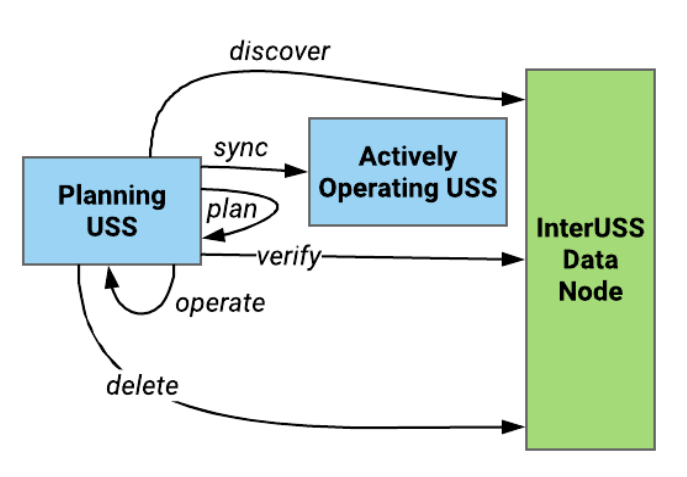
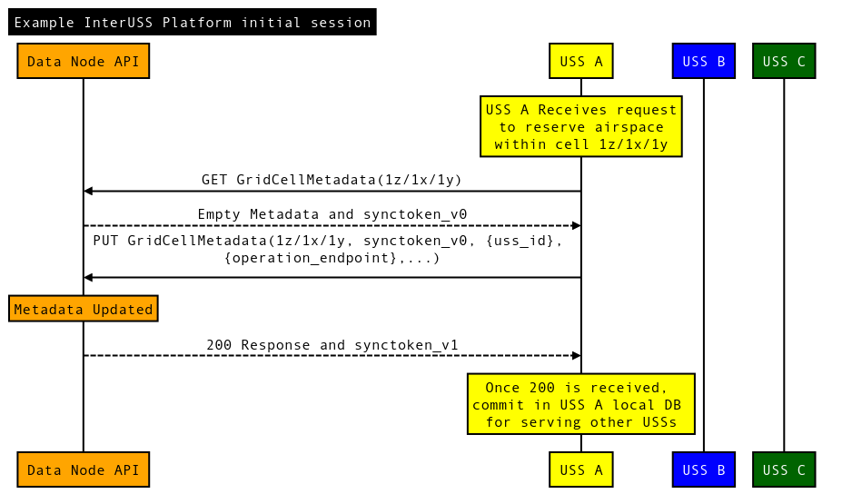

# TCL4 USS to USS Communication and Synchronization Wrapper

This repository contains a simple, open, and API used for separate UAS Service
Suppliers (USS) to communicate during TCL4 UAS operations, known as the InterUSS
Platform™. This flexible and distributed system is used to connect multiple USSs
operating in the same general area to share safety information while protecting
operator and consumer privacy. The system is focused on facilitating
communication amongst actively operating USSs with no details about UAS
operations stored or processed on the InterUSS Platform.

## NOTE: This is a NASA UTM Project branch specifically for TCL4
**In the future, this can be a branch or a fork from a publicly-available repo
of the InterUSS Platform.**

### Main Differences from the master branch of the InterUSS Platform:

*   GridCellMetaData endpoint is called GridCellOperator.
*   PUT GridCellOperator now uses a json body of the entire request, rather than form fields
*   New and different data elements within a Grid Cell Operator:
    * Removed scope, operation_endpoint, operation_format
    * Added uss_baseurl (the location for the required TCL4 USS endpoints),
    * Added announcement_level (an already operating USS can request for other USSs to contact
      them when they update this cell),
    * Added an array of operations (a list of operations including the gufi, start and end times,
      and the operation signature)
*   Added a new endpoint (GridCellOperation) for adding/updating/removing a single operation
    * USSs must PUT a GridCellOperator at least once, and then can use GridCellOperation for single
      updates. Useful for cells with lots of flights.
    * USSs can also choose to use GridCellOperator and update the entire list of operations
      every time.

### Main Features

*   Simple, open, flexible, and scalable information interface and Optimistic
    Concurrency Control to simplify USS to USS communication and control race
    conditions.
*   Effective information sharing to enable effective, deterministic conflict
    detection for flight planning across multiple overlapping 4D volumes from
    multiple USSs.
*   Effective reconstitution of flight volumes when restarting a USS or adding a
    USS to an existing environment.

### Main Assumptions

*   Trust each USS to deconflict with known flight data.
*   Auditing is available, as all USSs can verify the authorship and addition of
    erroneous conflictions.
*   Deconfliction is simply defined as no overlapping flights in time and
    volume.

For the API specification and online test area, see
https://app.swaggerhub.com/apis/InterUSS_Platform/data_node_api/tcl4.0.0

## Sequence for USS information exchange

When a USS wants to plan a flight, the “planning USS” performs the following steps:

1.  Discover - Communicates with the InterUSS platform to discover what other
    USSs have an active operation in the specific area of flight and how to
    contact them. Flight details are not stored in the InterUSS Platform for
    both minimizing data bandwidth and maximizing privacy.
2.  Sync - If there are other USSs with active operations, the planning USS
    contacts the other USS(s) with active operations in the area and retrieves
    the operational information necessary to de-conflict the operation.
3.  Plan & Verify - Once the operation is safely planned and deconflicted, the
    USS updates the InterUSS platform with their contact information for other
    USSs to use for future discovery. This update provides final verification
    that the planning was done with the latest operational picture.
4.  Delete - Once the operation is completed, the USS removes their information
    as they do not need to be contacted in the future since the USS no longer
    has operations in that specific area of flight. All of these operations are
    secured using a standard OAuth communications flow, authorized by a
    governmental authority or, in the absence of an authority in certain parts
    of the world, industry provided OAuth solutions decided by the InterUSS
    Technical Steering Committee.

For an additional examples, this [Sequence Diagram](assets/USS2.png) shows a
more complex operation with three USSs, two trying to plan at the same time.
This [Sequence Diagram](assets/USS3.png) shows a USS affecting multiple grids.
This [Sequence Diagram](assets/USS4.png) shows another USS updating one of
multiple grids during an update. And finally, This
[Sequence Diagram](assets/USS5.png) shows different examples of protection with
concurrent updates.

## Directories of Interest:

*   datanode/docker: instructions to download and start your own datanode image
    as well as the source to create your own docker image to test
*   datanode/src: all of the source code for running the API and Interface layer

## Contribution

[Contribution guidelines for this project](CONTRIBUTING.md)

Every file containing source code must include copyright and license
information. This includes any JS/CSS files that you might be serving out to
browsers. (This is to help well-intentioned people avoid accidental copying that
doesn't comply with the license.)

Apache header:

    Copyright 2018 Google Inc.

    Licensed under the Apache License, Version 2.0 (the "License");
    you may not use this file except in compliance with the License.
    You may obtain a copy of the License at

        https://www.apache.org/licenses/LICENSE-2.0

    Unless required by applicable law or agreed to in writing, software
    distributed under the License is distributed on an "AS IS" BASIS,
    WITHOUT WARRANTIES OR CONDITIONS OF ANY KIND, either express or implied.
    See the License for the specific language governing permissions and
    limitations under the License.
