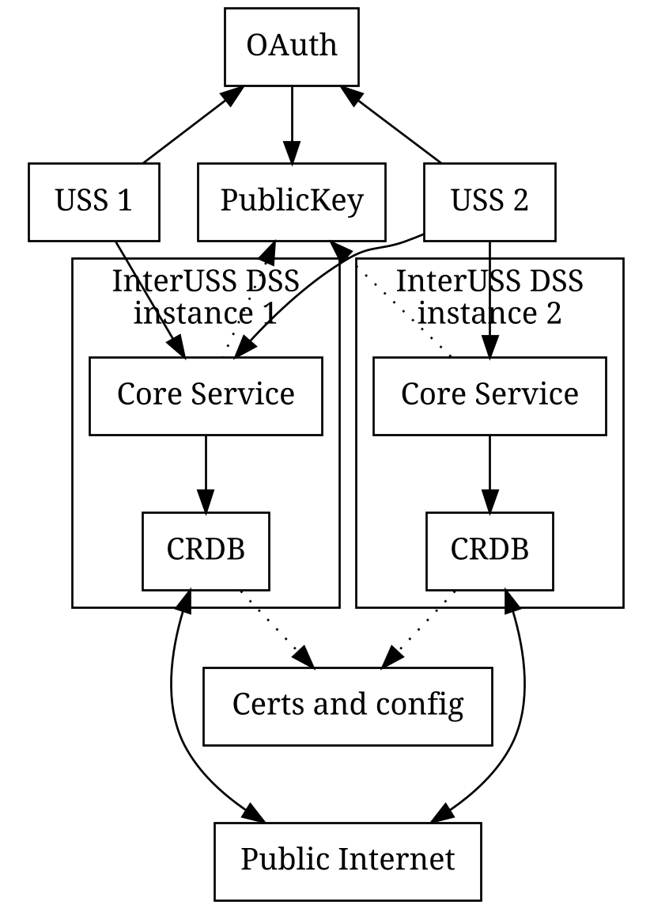

## DSS

Conceptual background on the DSS and services it supports may be found [here](./concepts.md).

## Simplified architecture

### Overview

A "DSS Region" consists of one or more DSS instances sharing the same
DSS Airspace Representation (DAR) by forming a single CockroachDB
cluster.  In the simplified diagram above, two DSS instances share the
same DAR via CRDB certificates and configuration which means the two
HTTPS frontends may be used interchangeably.  USS 1 chooses to use only
instance 1 while USS 2 uses both instances for improved resilience to
failures.

### HTTPS frontend

Serves as an HTTPS gateway to the business logic, translating between
HTTPS request and gRPC to allow users to communicate to the DSS via
simple HTTPS calls. This code is currently generated via
[grpc-gateway](https://github.com/grpc-ecosystem/grpc-gateway), and does
not do much other than translation.  See the API specification
here:
- [Network Remote ID](https://tiny.cc/dssapi_rid)
- [Strategic Coordination and Deconfliction](https://tiny.cc/dssapi_rid)

### Core Service

Component responsible for all the business logic as well as
authentication. This backend talks directly to CockroachDB.

### CockroachDB (CRDB)

Individual CockroachDB nodes hosting sharded data of the DAR. More information about CockroachDB
[here](https://www.cockroachlabs.com/docs/stable/architecture/overview.html).

The current implementation relies on CockroachDB for data storage and synchronization
between DSS participants. See [implementation details](implementation_details.md) for
more information.

### DB Manager

Component responsible for performing orderly database schema migrations, including database bootstrapping. Invoked automatically on first run along with the CRDB cluster-init job, or when requested manually by a user.

## Directories of Interest:
*   [`build/`](build) has all of the configuration required to build and
    deploy a DSS instance. The README in that directory contains more
    information.
*   [`pkg/`](pkg) contains all of the source code for the DSS. See the
    README in that directory for more information.
*   [`cmds/`](cmds) contains entry points and docker files for the
    actual binaries (the `http-gateway` and `core-service`)
*   [`test/`](test) contains some tests; see [the README](test/README.md)
    for more information about testing.
