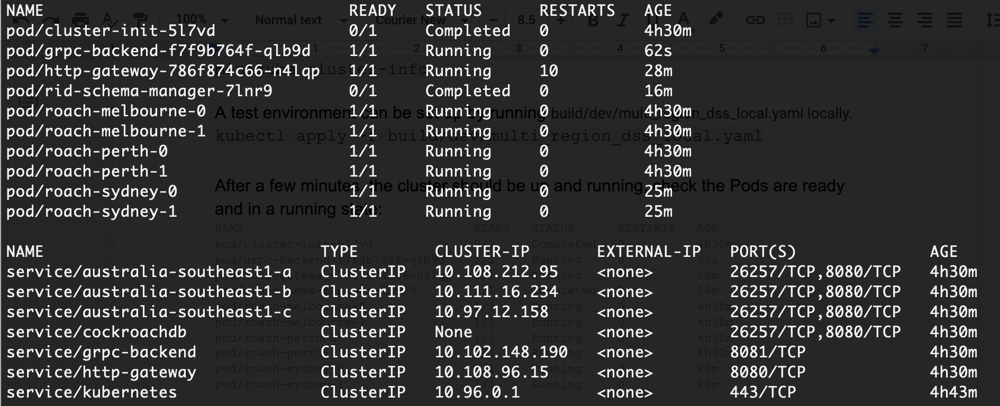
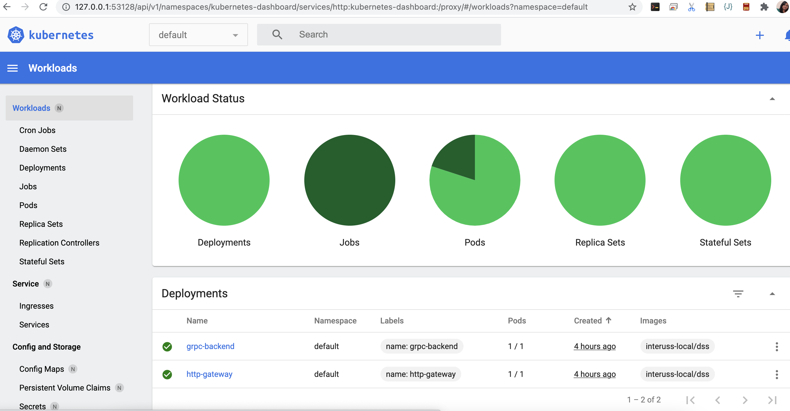

# Kubernetes (minikube) local setup

This page demonstrates setting up Multi-region DSS instances on localhost using Kubernetes’s minikube. Following are the instructions to create a cluster which consists of three regions, each region has 2 CRDB nodes.

If minikube is not set up, please follow these [instructions](https://gist.github.com/kevin-smets/b91a34cea662d0c523968472a81788f7).
Below is the high level architecture. We create:
- 3 StatefulSets CRDB cluster region, each region with 2 replicas.
- 3 Services, one for each region, so we can simulate accessing a particular region.
- 1 Service of type ClusterIP, to allow all Pods to communicate with each other
- 1 Pod, to create a gRPC-backend server.
- 1 Service to communicate with grpc-backend
- 1 Pod, to create http-gateway setup.
- 1 Service to communicate with http-gateway
- 1 ConfigMap, to set up the RID DB schema.
- 2 Jobs, 1 cluster-init and 1 to initialize RID DB schema.

## Setup

Since we are using Minikube, instead of using Docker images from a registry, you can simply build the image using the same Docker host as the Minikube VM, so that the images are automatically present.
To do this we need to make sure we are using the Minikube Docker daemon, you can do this by running the following:

`eval $(minikube docker-env)`

Note: Later, when you no longer wish to use the Minikube host, you can undo this change by running: `eval $(minikube docker-env -u)`

Pull images locally by running:

`build/build.sh` 

Start minikube by:

`minikube start`

Check the status of minikube by:

`minikube status`

`minikube cluster-info`

A test environment can be set up by running build/dev/minikube/multi_region_dss_local.yaml locally.

`kubectl apply -f build/dev/minikube/multi_region_dss_local.yaml`

After a few minutes, the cluster should be up and running, check the Pods are ready and in a running state:


We can open the Kubernetes dashboard in a browser using the following command which will open a browser window with your dashboard:
`minikube dashboard`




## Access the DB Console

In a new terminal window, port-forward from your local machine to the cockroachdb service:
`kubectl port-forward service/cockroachdb 8080`

## Verify data ranges

Connect to one of the CRDB nodes, create a table and populate it with data.
`kubectl exec -i roach-sydney-1 -- ./cockroach sql --insecure <<< 'create table test (c1 int, c2 int); insert into test values (1,1),(2,2),(3,3),(4,4),(5,5),(3300000,3300000),(4300000,4300000),(5300000,5300000);'`

## Other useful commands

To remove all the pods and services from minikube ‘default’ namespace:
`kubectl -n default delete pod,svc --all`

Delete all configs from minikube:
`kubectl delete -f <config-file>.yaml` 

CockroachDB port forwarding, `cockroachdb` is the name of the public service:
`kubectl port-forward service/cockroachdb 8080`

Deleting a specific resource:
`kubectl delete <resource> <resource-name>`
Example:
`kubectl delete job rid-schema-manager`


## Troubleshooting

### rid-db-manager pod is failing to run

Follow the [instructions](https://kubernetes.io/docs/tasks/inject-data-application/define-command-argument-container/#notes) to define the command line arguments.

An example set of arguments required for RID DB schema is as mentioned below:

```
spec:
     containers:
       - image: interuss-local/db-manager:latest
         command: ["/usr/bin/db-manager"]
         args: ["--cockroach_host=cockroachdb-public.default", "--cockroach_port=26257", "--db_version=3.1.1", "--schemas_dir=/db-schemas/defaultdb"]
     
```

### ERROR: OCI runtime create failed: container_linux.go:367: starting container process caused: exec: "/bin/bash": stat /bin/bash: no such file or directory: unknown

Do a complete cleanup of docker containers by:
`kubectl delete -f <config-file>.yaml `
`docker kill $(docker ps -q)`
`docker rm $(docker ps -a -q)`

### grpc-backend error: "operating without authorizing interceptor"
Add volume to grpc-backend pod.
TODO: check for the right way to pass following cert file to volumes.

```
    volumes:
    - $PWD/../test-certs:/var/test-certs:ro
```

As a workaround, update following args in the grpc-backend pod configurations.

```
- --jwks_endpoint=https://oauth.casa-staging.rpasplatform.net/jwks.json
- --jwks_key_ids=1
```
