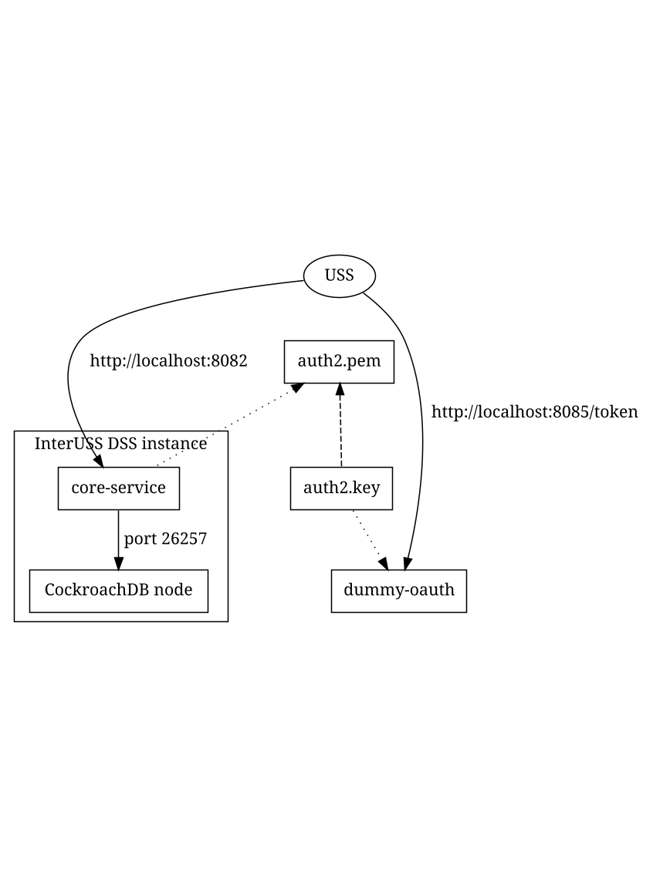

# Simple standalone local test/evaluation/development instance

_Note that all deployment strategies below require the use of [Docker](https://docs.docker.com/v17.12/install/)._

## Architecture



When the simple standalone deployment below is used, it will construct a DSS
sandbox environment consisting of:
* A DSS instance, consisting of:
  * A single CockroachDB node running in insecure mode via docker, communicating
    on port 26257 internally and exposing a web admin console on [port
    8080](http://localhost:8080) externally
  * [Core Service](../../cmds/core-service) listening by default on port 8081
    internally, configured to
    * Connect to a CockroachDB node (implicitly port 26257)
    * Validate access tokens with [the auth2.pem public
      key](../test-certs/auth2.pem)
    * Expect access tokens to specify an `aud` of `localhost`
  * [HTTPS gateway](../../cmds/http-gateway) listening on port 8082 externally
    and directing requests translated into gRPC to port 8081 internally
* A [Dummy OAuth server](../../cmds/dummy-oauth) exposing an endpoint at
  http://localhost:8085/token externally to generate dummy JWT access tokens
  that validate against [the auth2.pem public key](../test-certs/auth2.pem)

## Prerequisites

* Install [Docker](https://docs.docker.com/v17.12/install/)
* Install [docker-compose](https://docs.docker.com/compose/install/)

## Run

Simply execute [`./run_locally.sh`](run_locally.sh).  This will build the required
Docker images if necessary and then construct the system described above.

When this system is active (log messages stop being generated), the following
endpoints will be available:

* Dummy OAuth Server: http://localhost:8085/token
* DSS HTTP Gateway Server: http://localhost:8082/healthy
* CockroachDB web UI: http://localhost:8080

In a different window, run [`./check_dss.sh`](check_dss.sh) to run a
demonstration RID query on the system.  The expected output is an empty list of
ISAs (no ISAs have been announced).

To perform more complicated actions manually, see
[the Postman collection](postman_collection.json) in this folder (use with
[Postman](https://www.postman.com/downloads/)).

To stop the system, just press ctrl-c or cmd-c.

## Debugging Mode

[`run_locally.sh`](run_locally.sh) can also run in debugging mode, which enables
debugging the Core Service code line by line with your favorite IDE. It is a very
straightforward process with just 2 steps:

**Step 1**

Run `run_locally.sh debug`, we will see the local-dss-core-service starts with the
DEBUG MODE: **on**, and the API server is listening at port : **4000**.

-  `local-dss-core-service_1      | Debug Mode: on`
-  `local-dss-scd-bootstrapper_1  | Allowing time for CRDB node to come up...`
-  `local-dss-core-service_1      | API server listening at: [::]:4000`

**Step 2 (One Time Effort)**

Add a remote debug configuration with your favorite IDE. Here we use IntelliJ / GoLand
as an example:

- Click `Edit Configuration` in the dropdown list right next to the 'bug' icon.

    
- Add a new `Go Remote` configuration.

    
- Set the Host as `localhost` and Port as `4000`, click `OK`.

    

**Enjoy!**

All Set, let's start the debug configuration created in the step 1 and we are able
to debug any request sent to the local DSS endpoints hosted at `localhost:8082`.

- Drop breakpoints and diagnose in real time

    

- Access variables

    
## Advanced

[`run_locally.sh`](run_locally.sh) is a thin wrapper around a `docker-compose`
command and all the `docker-compose` verbs may be passed to `run_locally.sh`.
The default option is `up --build` which forces to re-build the local deployment images before starting the containers; however, containers can be started directly by `run_locally.sh up`.
The system can be removed entirely with `run_locally.sh down`.
See all `docker-compose` verbs
[here](https://docs.docker.com/compose/reference/overview/).

## Database migration and versioning

`run_locally.sh` automatically creates a database with the latest schema
versions.  To migrate to a different version, use
[`migrate_local_db.sh`](migrate_local_db.sh).  It accepts two arguments: the
database name ([`rid`](../deploy/db_schemas/rid) for remote ID or
[`scd`](../deploy/db_schemas/rid) for SCD) and the desired schema version (see
[`db_schemas`](../deploy/db_schemas) for options).  The desired schema version
may also be `latest`.  For example:

```bash
./migrate_local_db.sh rid 3.1.0
./migrate_local_db.sh scd latest
```

If a downgrade step is not yet implemented, the database can be removed using a
command like the one below, using `defaultdb` instead of `rid` if wiping remote
ID prior to schema version 4.0.0, and `scd` instead of `rid` if wiping SCD:

```bash
docker container exec -i dss_sandbox_local-dss-crdb_1 cockroach sql --insecure <<< 'use postgres; drop database rid cascade;'
```

To just determine the current version of a database schema, simply omit the
target version parameter to `migrate_local_db.sh`.

## Troubleshooting

If one or more of the necessary ports are not available, identify the process
using a port with `lsof -i tcp:8080`.
