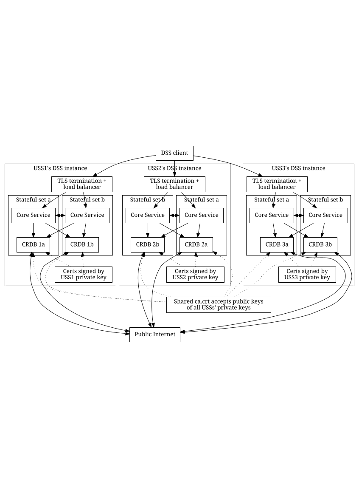

# Kubernetes deployment

## Introduction

See [introduction](operations/pooling.md#introduction)

## Architecture

The expected deployment configuration of a DSS pool supporting a DSS Region is
multiple organizations to each host one DSS instance that is interoperable with
each other organization's DSS instance.  A DSS pool with three participating
organizations (USSs) will have an architecture similar to the diagram below.

_**Note** that the diagram shows 2 stateful sets per DSS instance.  Currently, the
helm and tanka deployments produce 3 stateful sets per DSS instance.  However, after
Issue #481 is resolved, this is expected to be reduced to 2 stateful sets._

### Terminology notes

See [teminology notes](operations/pooling.md#terminology-notes).

## Pooling

### Objective

See [Pooling Objective](operations/pooling.md#objective) and subsections.

### Additional requirements

See [Additional requirements](operations/pooling.md#additional-requirements).

### Survivability

One of the primary design considerations of the DSS is to be very resilient to
failures.  This resiliency is obtained primarily from the behavior of the
underlying CockroachDB database technology and how we configure it.  The diagram
below shows the result of failures (bringing a node down for maintenance, or
having an entire USS go down) from different starting points, assuming 3 replicas.

The table below summarizes survivable failures with 3 DSS instances configured according
to the architecture described above.  Each system state is summarized by three
groups (one group per USS) of two nodes per USS.

* 🟩 : Functional node has no recent changes in functionality
* 🟥 : Non-functional node in down USS has no recent changes in functionality
* 🟧 : Non-functional node due to USS upgrade or maintenance has no recent changes in functionality
* 🔴 : Node becomes non-functional due to a USS going down
* 🟠 : Node becomes non-functional due to USS upgrade or maintenance

| Pre-existing conditions  | New failures | Survivable?
| --- | --- | ---
| (🟩 , 🟩 ) (🟩 , 🟩 ) (🟩 , 🟩 ) | (🟩 , 🟩 ) (🟩 , 🟩 ) (🟩 , 🟠 ) | 🟢 Yes
|                                    | (🟩 , 🟩 ) (🟩 , 🟠 ) (🟩 , 🟠 ) | 🔴 No; some ranges may be lost because of [this bug](https://github.com/cockroachdb/cockroach/issues/66159)
|                                    | (🟩 , 🟠 ) (🟩 , 🟠 ) (🟩 , 🟠 ) | 🔴 No; some ranges may be lost
|                                    | (🟩 , 🟩 ) (🟩 , 🟩 ) (🔴 , 🔴 ) | 🟢 Yes
|                                    | (🟩 , 🟩 ) (🔴 , 🔴 ) (🔴 , 🔴 ) | 🔴 No; ranges guaranteed to be lost
| (🟩 , 🟩 ) (🟩 , 🟩 ) (🟩 , 🟧 ) | (🟩 , 🟩 ) (🟩 , 🟠 ) (🟩 , 🟧 ) | 🟢 Yes
|                                    | (🟩 , 🟠 ) (🟩 , 🟠 ) (🟩 , 🟧 ) | 🔴 No; some ranges may be lost because of [this bug](https://github.com/cockroachdb/cockroach/issues/66159)
|                                    | (🟩 , 🟩 ) (🟩 , 🟩 ) (🔴 , 🔴 ) | 🟢 Yes
|                                    | (🟩 , 🟩 ) (🔴 , 🔴 ) (🟩 , 🟧 ) | 🟡 Yes, with 3 replicas
| (🟩 , 🟩 ) (🟩 , 🟧 ) (🟩 , 🟧 ) | (🟩 , 🟠 ) (🟩 , 🟧 ) (🟩 , 🟧 ) | 🟢 Yes
|                                    | (🟩 , 🟩 ) (🟩 , 🟧 ) (🟠 , 🟧 ) | 🟢 Yes
|                                    | (🟩 , 🟩 ) (🟩 , 🟧 ) (🔴 , 🔴 ) | 🟢 Yes
|                                    | (🔴 , 🔴 ) (🟩 , 🟧 ) (🟩 , 🟧 ) | 🟡 Yes, with 3 replicas
| (🟩 , 🟧 ) (🟩 , 🟧 ) (🟩 , 🟧 ) | (🟩 , 🟧 ) (🟩 , 🟧 ) (🟠 , 🟧 ) | 🟡 Yes, with 3 replicas
|                                    | (🟩 , 🟧 ) (🟠 , 🟧 ) (🟠 , 🟧 ) | 🔴 No; ranges guaranteed to be lost
|                                    | (🟠 , 🟧 ) (🟠 , 🟧 ) (🟠 , 🟧 ) | 🔴 No; ranges guaranteed to be lost
|                                    | (🟩 , 🟧 ) (🟩 , 🟧 ) (🔴 , 🔴 ) | 🟡 Yes, with 3 replicas
| (🟩 , 🟩 ) (🟩 , 🟩 ) (🟥 , 🟥 ) | (🟩 , 🟩 ) (🟩 , 🟠 ) (🟥 , 🟥 ) | 🟡 Yes, with 3 replicas
|                                    | (🟩 , 🟠 ) (🟩 , 🟠 ) (🟥 , 🟥 ) | 🔴 No; some ranges may be lost
|                                    | (🟩 , 🟩 ) (🔴 , 🔴 ) (🟥 , 🟥 ) | 🔴 No; some ranges may be lost

### Sizing

#### Introduction
This section contains an estimate of the computational and other resources
likely necessary to support expected demand in a country similar to the United
States.

#### Time required to fulfill queries for a single flight
1. Assume 1 ISA per flight (worst case)
    1. 2 ISA management queries per flight (create & delete)
1. Assume 90% of flights are nominal and require 3 strategic deconfliction queries (Accepted, Activated, Ended) while 10% of flights have problems and require 7 strategic deconfliction queries
    1. 3.4 strategic deconfliction queries per flight
1. Assume 0.1 seconds to fulfill a query
    1. Therefore, 0.54 seconds required (on average) to fulfill management queries to support a flight

#### Time required to fulfill queries for a RID Display Provider
1. Assume 2 Display Providers viewing each flight on average, 4 subscriptions per flight per DP, and 40% chance of subscription reuse
    1. 9.6 subscription queries per flight
    1. 0.96 seconds required (on average) to fulfill viewing queries to support a flight

#### Required parallelism
1. Use [348,537 remote pilots in 2024](https://www.faa.gov/uas/resources/by_the_numbers/)
1. Assume 100 flights per month per remote pilot
1. Use [989,916 recreational pilots](https://www.faa.gov/data_research/aviation/aerospace_forecasts/media/FY2020-40_faa_aerospace_forecast.pdf) as a baseline (even though this is likely number of aircraft, not number of pilots) and double it for the future
1. Use [7.1 flights per month per recreational pilot](https://www.faa.gov/data_research/aviation/aerospace_forecasts/media/FY2020-40_faa_aerospace_forecast.pdf)
1. Therefore, expect about 18.6 flights per second
1. With 1.5 seconds of query time per flight, a nominal parallelism of 28 is required to satisfy the demand
1. Assuming a peak-average ratio of 3.5, a parallelism of 98 is required

#### Required resources
1. With Cockroach Labs guidance of 4 parallel operations per vCPU, the DSS pool requires 25 vCPUs.
1. Assuming 3 DSS instances and the need to continue to operate when one instance is down, each DSS instance requires 13 vCPUs.
1. Using 8-vCPU virtual machines (like n2-standard-8), this means each instance needs 2 of these virtual machines
1. Assuming that 5 days' worth of flights are occupying space on disk at any given time and that each flight record on disk is 100k, approximately 83 GB of storage is required
    1. Note that Cockroach Labs recommends 4,000 read IO/s and 4,000 write IO/s, and some cloud providers scale storage speed with storage size, so 83 GB of storage may be far less than is necessary to achieve these speed numbers
