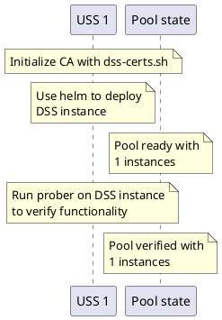
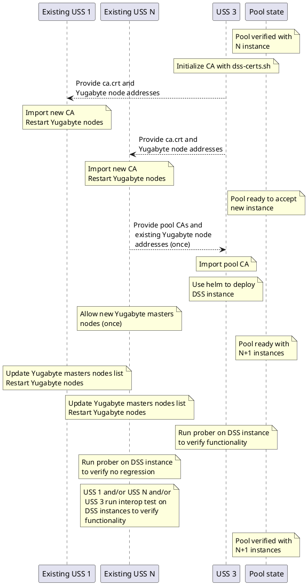

# DSS Pooling

> [!WARNING] This document is about pooling with **Yugabyte**. CockroachDB
> documentation is [there](./pooling-crdb.md).

## Introduction

The DSS is designed to be deployed in a federated manner where multiple
organizations each host a DSS instance, and all of those instances interoperate.
Specifically, if a change is made on one DSS instance, that change may be read
from a different DSS instance.  A set of interoperable DSS instances is called a
"pool", and the purpose of this document is to describe how to form and maintain
a DSS pool.

It is expected that there will be exactly one production DSS pool for any given
DSS region, and that a DSS region will generally match aviation jurisdictional
boundaries (usually national boundaries).  A given DSS region (e.g.,
Switzerland) will likely have one pool for production operations, and an
additional pool for partner qualification and testing (per, e.g.,
F3411-19 A2.6.2).

### Terminology notes

Yugabyte establishes a distributed data store called a "cluster". This cluster
stores the DSS Airspace Representation (DAR) in multiple SQL databases within
that cluster.  This cluster is composed of many Yugabyte nodes, potentially
hosted by multiple organizations.

Kubernetes manages a set of services in a "cluster". This is an entirely
different thing from the Yugabyte data store, and this type of cluster is what
the deployment instructions refer to. A Kubernetes cluster contains one or more
node pools: collections of machines available to run jobs. This node pool is an
entirely different thing from a DSS pool.

## Objective

A pool of InterUSS-compatible DSS instances is established when all of the
following requirements are met:

1. Each Yugabyte node is addressable by every other Yugabyte node
1. Each Yugabyte node is discoverable
1. Each Yugabyte node accepts the certificates of every other node
1. The Yugabyte cluster is initialized

The procedures in this document are intended to achieve all the objectives
listed above, but these procedures are not the only ways to achieve the
objectives.

### "Each Yugabyte node is addressable by every other Yugabyte node"

Every Yugabyte node must have its own externally-accessible hostname (e.g.,
1.tserver.db.dss-prod.example.com), or its own hostname:port combination (e.g.,
db.dss-prod.example.com:26258).

There are two type of nodes in a Yugabyte cluster: Master and TServer. Both ones
must be accessible. The ports on which Yugabyte communicates must be open to
others participants:

* Master: gRPC: **7100**
* Master: Admin UI: 7000
* TServer: gRPC: **9100**
* TServer: Admin UI: 9000
* TServer: ycql: 9042
* TServer: ysql: **5433**
* TServer: metrics: 13000
* TServer: metrics: 12000

The ports in bold are mandatory. The others ones are needed for management UI,
the UI won't work correctly if any of those port is not reachable by other
nodes.

This requirement may be verified by conducting a standard TLS diagnostic
(like [this one](https://www.wormly.com/test_ssl)) on the hostname:port
for each TServer node (e.g., 0.tserver.db.dss.example.com:5433). The "Trust"
characteristic will not pass because the certificate is issued by
a custom CA which is not a generally-trusted root CA, but we
explicitly enable trust by manually exchanging the trusted CA public keys
in ca.crt (see "Each Yugabyte node accepts the certificates of every other
node" below). However, all other checks should generally pass.

NB: Only ports in bold and the 9042 are using TLS. You may test the others ones
with your browser to check for connectivity.

> [!CAUTION]
> It's recommended to restrict access to those ports and only allow IPs of
> others participants. However guides and helm charts haven't been adapted yet.

### "Each Yugabyte node is discoverable"

When a Yugabyte node is brought online, it must know how to connect to the
existing network of nodes. This is accomplished by providing an explicit list of
nodes to contact. Each node contacted will provide a list of nodes it is
connected to in the network ("gossip"), so not every node must be present in the
explicit list, but it's recommended to do so. The explicit list shall contain,
at a minimum, all known nodes when creating the DSS instance and shall be
updated regularly. Yugabyte nodes have some difficulites to locate primary nodes
if they don't have the full list of known nodes.

### "Each Yugabyte node accepts the certificates of every other node"

Yugabyte uses TLS to secure connections, and TLS includes a mechanism to
ensure the identity of the server being contacted.  This mechanism requires a
trusted root Certificate Authority (CA) to sign a certificate containing the
public key of a particular server, so a client connecting to that server can
verify that the certificate (containing the public key) is endorsed by the root
CA as being genuine. Yugabyte certificates require a claim that standard web CAs
will not sign, so instead each USS acts as their own root CA.  When USS 1
is presented with certificates signed by USS 2's CA, USS 1 must know that it
can trust that certificate.  We accomplish this by exchanging all USSs' CA
public keys out-of-band in ca.crt, and specifying that certificates signed by
any of the public keys in ca.crt should be accepted when considering the
validity of certificates presented to establish a TLS connection between nodes.

The private CA key `dss-certs.py` generates is stored in the `ca` folder. The
private CA key is used to generate all node certificates and client
certificates. Once a pool is established, a USS avoids regenerating this CA
keypair, and use the existing ones by default. If a USS generates a new CA
keypair, the new public key must be added to the pool's combined ca.crt, and all
USSs in the pool must adopt the new combined ca.crt before any nodes using
certificates generated by the new CA private key will be accepted by the pool.

### "The Yugabyte cluster is initialized"

A Yugabyte cluster of databases is like the Ship of Theseus: it is composed of
many nodes which may all be replaced, one by one, so that a given Yugabyte
cluster eventually contains none of its original nodes.  Unlike the Ship of
Theseus, however, a cluster is clearly identified by its cluster ID (e.g.,
b2537de3-166f-42c4-aae1-742e094b8349) -- if the cluster ID is the same, it is
the same cluster (and vice versa). Once for the entire lifetime of the Yugabyte
cluster, it is created automatically during initialization of the first set of
Yugabyte nodes, if all initial nodes see each others in a uninitialized state.

## Additional requirements

These requirements must be met by every DSS instance joining an
InterUSS-compatible pool.  The deployment instructions produce a system that
complies with all these requirements, so this section may be ignored if
following those instructions.

- All Yugabyte nodes must be run in secure mode.
  - use_node_to_node_encryption enabled
  - use_client_to_server_encryption enabled
  - allow_insecure_connections disabled
- The ordering of the `--locality` flag keys must be the same across all
  CockroachDB nodes in the cluster.
- All DSS instances in the same cluster must point their ntpd at the same NTP
  Servers.

## Creating a new pool
All DSS instances are equal peers, and any set of DSS instance can be chosen to
create the pool initially. After the pool is established, additional DSS
instance can join it. After that joining process is complete, it can be
repeated any number of times to add additional DSS instances, though 7 is the
maximum recommended number of DSS instances for performance reasons. The
following diagram illustrates the pooling process for the first two instances:

Adding participant is illustrated below. Some actions marked with `(once)` need
to be run only once by one participant otherwise all participants in the current
pool must ran then.

### Establishing a pool with first instances
The USSs owning the first DSS instances should follow
[the deployment instructions](README.md).

Each DSS instance must set `yugabyte_external_nodes` with the list of each
others DSS instance Yugabyte master nodes public endpoints, and CA certificates
must be exchanged.

It's possible to have one DSS instance as starting point. In that case,
`yugabyte_external_nodes` will be empty and no CA exchange is needed.

> [!NOTE]
> Quick reminder for CA management:
>
> Each DSS instance should use `./dss-certs.sh init` To get the CA that should
> be sent to others instances, use `./dss-certs.sh get-ca` To import the CA of
> others DSS instance, use `./dss-certs.sh add-pool-ca` Finally, apply
> certificates on the kubernetes cluster with `./dss-certs.sh apply`

Ensure placement info is how you want it. See the section below for placement
requirements.

Upon deployment completion, the following should be run against the DSS instance
to verify functionality:

 - The [prober test](https://github.com/interuss/monitoring/blob/main/monitoring/prober/README.md)
 - The [USS qualifier](https://github.com/interuss/monitoring/tree/main/monitoring/uss_qualifier),
   using the [DSS Probing](https://github.com/interuss/monitoring/blob/main/monitoring/uss_qualifier/configurations/dev/dss_probing.yaml) configuration

### Joining an existing pool with new instance
A USS wishing to join an existing pool (of perhaps just one instance following
the prior section) should follow [the deployment instructions](README.md).  They
will be joining an existing cluster, and they will need to request all CAs that
the pool is currently using (any one member of the pool may provide it). The
joining USS will also need a list of Yugabyte node addresses.

The joining USS must create his own CA with `./dss-certs.sh init` and retrieve
it with `./dss-certs.sh get-ca`. This certificate must be provided to each
existing DSS instance in the pool that will import it with `./dss-certs.sh
add-pool-ca` and `./dss-certs.sh apply`.

One of existing DSS instance shall provide to the joining USS all existing
certificate, using `./dss-certs.sh get-pool-ca`. The joining USS can import them
with `./dss-certs.sh add-pool-ca` and finally apply certificates with
`./dss-certs.sh apply`. As an alternative, each DSS instance can provide its
individual CA.

Participants shall ensure they work with a coherent set of certificate by
comparing the pool CA hash. It is displayed after adding certificates or using
the `./dss-certs.sh list-pool-ca`.

When CAs have been exchanged and configured everywhere, the joining participant
can bring his system online (e.g. by applying helm charts onto his cluster). The
`yugabyte_external_nodes` setting shall be set **before** starting the Yugabyte
cluster.

New nodes shall be allowed into the cluster. For each new Yugabyte master node,
the following command shall be run on one master node of one existing DSS
instance :

> [!WARNING]
> The `master_addresses` in all commands below must include the Yugabyte master
> leader. Either always run commands in the cluster with the leader, or list all
> public addresses.

1. Connection to a master node:

    `kubectl exec -it yb-master-0 -- sh`

1. Preparation of certificates for the client:

    * `cp /opt/certs/yugabyte/node.yb-master-0.yb-masters.default.svc.cluster.local.crt /tmp/node.crt`
    * `cp /opt/certs/yugabyte/node.yb-master-0.yb-masters.default.svc.cluster.local.key /tmp/node.key`
    * `cp /opt/certs/yugabyte/ca.crt /tmp/ca.crt`

1. Addition of a new master node

    `yb-admin -certs_dir_name /tmp/ -master_addresses yb-master-0.yb-masters.default.svc.cluster.local:7100,yb-master-1.yb-masters.default.svc.cluster.local:7100,yb-master-2.yb-masters.default.svc.cluster.local:7100 change_master_config ADD_SERVER [PUBLIC HOSTNAME] 7100`

The last command can be repeated as needed, however a small delay is needed for
the cluster to settle when adding a new node. If you get `Leader is not ready
for Config Change, can try again`, just try again.

You should have all masters listed in the web ui or using the
`yb-admin -certs_dir_name /tmp/ -master_addresses yb-master-0.yb-masters.default.svc.cluster.local:7100,yb-master-1.yb-masters.default.svc.cluster.local:7100,yb-master-2.yb-masters.default.svc.cluster.local:7100 list_all_masters`
command.

The tserver nodes will join automatically, using the list of provided master
nodes. They can be listed for confirmation in the web ui or using the
`yb-admin -certs_dir_name /tmp/ -master_addresses yb-master-0.yb-masters.default.svc.cluster.local:7100,yb-master-1.yb-masters.default.svc.cluster.local:7100,yb-master-2.yb-masters.default.svc.cluster.local:7100 list_all_tablet_servers`
command.

The pool should then be re-verified for functionality
by running the prober test on each DSS instance, and the
[interoperability test scenario](https://github.com/interuss/monitoring/blob/main/monitoring/uss_qualifier/scenarios/astm/netrid/v19/dss_interoperability.md)
on the full pool (including the newly-added instance).

Finally, the joining USS should provide its Yugabyte node addresses to all other
participants in the pool, and each other participant should add those addresses
to the `yugabyte_external_nodes` list their Yugabyte nodes will attempt to
contact upon restart.

Ensure placement info is how you want it. See the section below for placement
requirements.

## Leaving a pool

In an event that requires removing Yugabyte nodes we need to properly and
safely decommission to reduce risks of outages.

It is never a good idea to take down more than half the number of nodes
available in your cluster as doing so would break quorum. If you need to take
down that many nodes please do it in smaller steps.

Ensure placement info is how you want it after removal. Ensure you're not
requesting impossible placement by removing nodes, otherwise it won't be
possible to request node deletion. See the section below for placement
requirements.

Note: If you are removing a specific node in a Statefulset, please know that
Kubernetes does not support removal of specific node; it automatically
re-creates the node if you delete it with `kubectl delete pod`.  You will need
to scale down the Statefulset and that removes the last node first (ex:
`yb-tserver-n` where `n` is the `size of statefulset - 1`, `n` starts at 0)

1. Check if all nodes are healthy in the web ui.

1. Connect to a Yugabyte master and copy certs, like introduced in the previous
   section.

1. For each TServer node to be removed:

    1. Blacklist one node in your cluster.

    `yb-admin -certs_dir_name /tmp/ -master_addresses yb-master-0.yb-masters.default.svc.cluster.local:7100,yb-master-1.yb-masters.default.svc.cluster.local:7100,yb-master-2.yb-masters.default.svc.cluster.local:7100 change_blacklist ADD [TSERVER_PUBLIC_HOSTNAME]`

    1. Wait for the node to be drained (no user tablet-peer or system-table-peer
       in the gui). If node is not draining, you may have placement constraints
       that prevent the removal of the node.

    1. Stop one node in your cluster.

    1. Wait until the node is marked as down and cluster will go into a
       non-healthy state then wait for recovery. When everything is green again
       proceed. Depending on settings, it may take time (15m) before the node is
       marked as dead.

    1. Remove the node:

    `yb-admin -certs_dir_name /tmp/ -master_addresses yb-master-0.yb-masters.default.svc.cluster.local:7100,yb-master-1.yb-masters.default.svc.cluster.local:7100,yb-master-2.yb-masters.default.svc.cluster.local:7100 remove_tablet_server [TSERVER_ID]`

    If the command is giving you an error, data of the node may not have been
    drain correctly dues to placement constraints.

    1. Remove the node from the black list:

    `yb-admin -certs_dir_name /tmp/ -master_addresses yb-master-0.yb-masters.default.svc.cluster.local:7100,yb-master-1.yb-masters.default.svc.cluster.local:7100,yb-master-2.yb-masters.default.svc.cluster.local:7100 change_blacklist REMOVE [TSERVER_PUBLIC_HOSTNAME]`

    1. Fully remove the node in your cluster.

        E.g you may delete persistent volumes.

1. For each Master node to be removed:

    1. Remove the master from the master list

    `yb-admin -certs_dir_name /tmp/ -master_addresses yb-master-0.yb-masters.default.svc.cluster.local:7100,yb-master-1.yb-masters.default.svc.cluster.local:7100,yb-master-2.yb-masters.default.svc.cluster.local:7100 change_master_config REMOVE_SERVER [PUBLIC HOSTNAME] 7100`

    If the master node to be removed is the current leader, you may make it step
    down with the following command:

    `yb-admin -certs_dir_name /tmp/ -master_addresses yb-master-0.yb-masters.default.svc.cluster.local:7100,yb-master-1.yb-masters.default.svc.cluster.local:7100,yb-master-2.yb-masters.default.svc.cluster.local:7100 master_leader_stepdown`

Finally, each pool participant should remove master addresses from the
`yugabyte_external_nodes` list their Yugabyte nodes will attempt to contact upon
restart and remove the CA of the participant.

> [!NOTE]
> Quick reminder for CA management:
>
> Remove the old CA, use `./dss-certs.sh remove-pool-ca <Certificate id>`
> Finally, apply certificates on the kubernetes cluster with
> `./dss-certs.sh apply`

## Placement

It's important to maintain a good placement strategy, ensuring data availability
in case of failures.

We do recommend a minimum of 3 participants and one copy in each participants.

You may use the `modify_placement_info` command to set placement settings.
Example:

* `yb-admin -certs_dir_name /tmp/ -master_addresses yb-master-0.yb-masters.default.svc.cluster.local:7100,yb-master-1.yb-masters.default.svc.cluster.local:7100,yb-master-2.yb-masters.default.svc.cluster.local:7100 modify_placement_info dss.uss-1,dss.uss-2,dss.uss-3 3`
* `yb-admin -certs_dir_name /tmp/ -master_addresses yb-master-0.yb-masters.default.svc.cluster.local:7100,yb-master-1.yb-masters.default.svc.cluster.local:7100,yb-master-2.yb-masters.default.svc.cluster.local:7100 modify_placement_info dss.uss-1,dss.uss-2,dss.uss-3,dss.uss-4,dss.uss-5 5`

You may however use a different strategy depending on your availability needs,
e.g. you may want to avoid common datacenter between the same DSS instance. To
do so, define a strategy in your pool and edit placement information as needed.
More information is available in [Yugabyte documentation](https://docs.yugabyte.com/preview/admin/yb-admin/#modify-placement-info).
