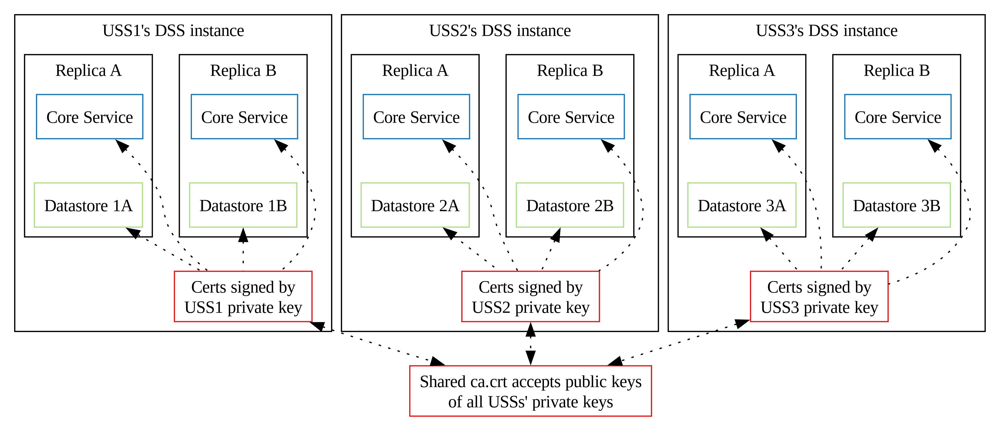
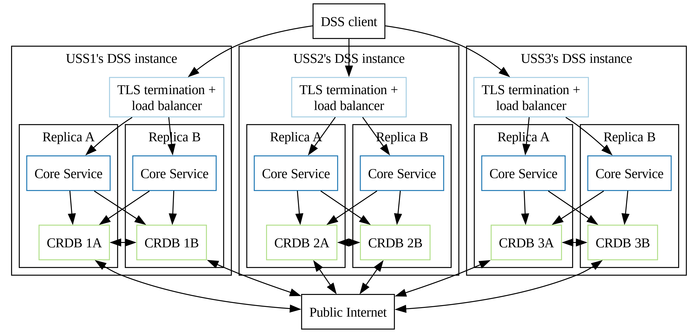
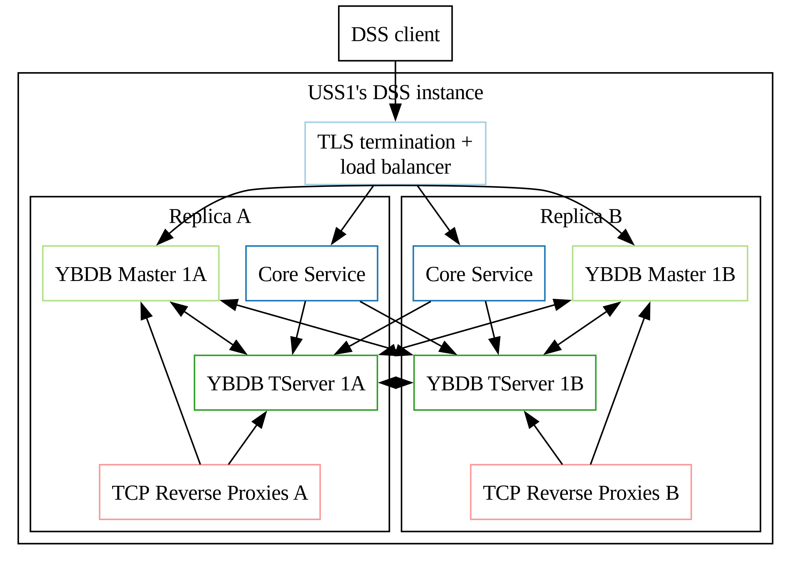
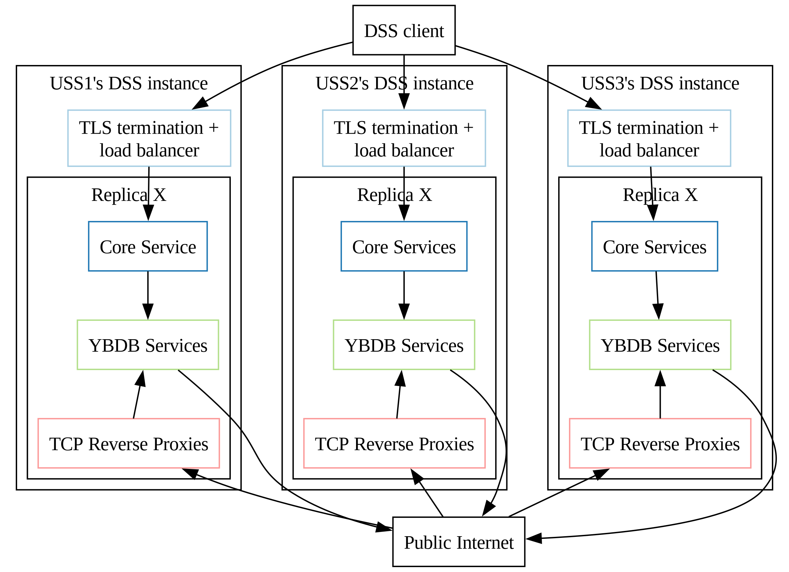
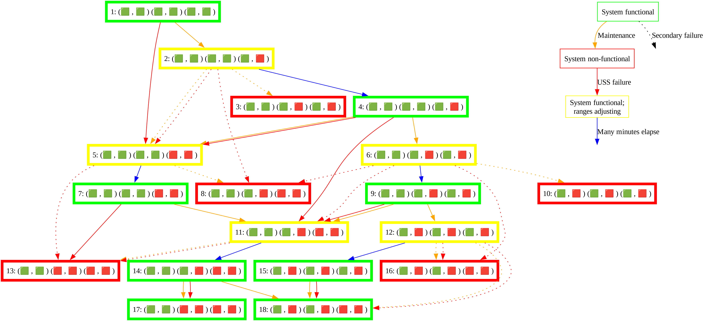

# Architecture

## Introduction

The expected deployment configuration of a DSS pool supporting a DSS Region is
multiple organizations to each host one DSS instance that is interoperable with
each other organization's DSS instance.  A DSS pool with three participating
organizations (USSs) will have an architecture similar to the diagram below.

_**Note** that the diagrams below shows 2 stateful sets per DSS instance.  Currently, the helm and tanka deployments produce 3 stateful sets per DSS instance.  However, after Issue #481 is resolved, this is expected to be reduced to 2 stateful sets._

### Certificates

This diagram shows how certificates are shared. It applies to both CockroachDB and Yugabyte deployments.

### CochroachDB

### Yugabyte

Detail on an instance level

Top level simplified view, with one replica shown and yugabyte services regrouped in one box.

To reduce the number of required public load balancers, we do use an intermediate reverse proxy to expose the ports of Yugabyte master and tserver on a shared public IP per stateful set instance.
Usual Kubernetes load balancers can't assign connection based on ports out of the box, so we use the reverse proxy to dispatch connections on both services depending on the connected port.

### Terminology notes

See [teminology notes](../operations/pooling.md#terminology-notes).

## Pooling

### Objective

See [Pooling Objective](../operations/pooling.md#objective) and subsections.

### Additional requirements

See [Additional requirements](../operations/pooling.md#additional-requirements).

### Survivability

One of the primary design considerations of the DSS is to be very resilient to
failures.  This resiliency is obtained primarily from the behavior of the
underlying CockroachDB database technology and how we configure it.  The diagram
below shows the result of failures (bringing a node down for maintenance, or
having an entire USS go down) from different starting points, assuming 3 replicas.

The table below summarizes survivable failures with 3 DSS instances configured according
to the architecture described above.  Each system state is summarized by three
groups (one group per USS) of two nodes per USS.

* 🟩 : Functional node has no recent changes in functionality
* 🟥 : Non-functional node in down USS has no recent changes in functionality
* 🟧 : Non-functional node due to USS upgrade or maintenance has no recent changes in functionality
* 🔴 : Node becomes non-functional due to a USS going down
* 🟠 : Node becomes non-functional due to USS upgrade or maintenance

| Pre-existing conditions  | New failures | Survivable?
| --- | --- | ---
| (🟩 , 🟩 ) (🟩 , 🟩 ) (🟩 , 🟩 ) | (🟩 , 🟩 ) (🟩 , 🟩 ) (🟩 , 🟠 ) | 🟢 Yes
|                                    | (🟩 , 🟩 ) (🟩 , 🟠 ) (🟩 , 🟠 ) | 🔴 No; some ranges may be lost because of [this bug](https://github.com/cockroachdb/cockroach/issues/66159)
|                                    | (🟩 , 🟠 ) (🟩 , 🟠 ) (🟩 , 🟠 ) | 🔴 No; some ranges may be lost
|                                    | (🟩 , 🟩 ) (🟩 , 🟩 ) (🔴 , 🔴 ) | 🟢 Yes
|                                    | (🟩 , 🟩 ) (🔴 , 🔴 ) (🔴 , 🔴 ) | 🔴 No; ranges guaranteed to be lost
| (🟩 , 🟩 ) (🟩 , 🟩 ) (🟩 , 🟧 ) | (🟩 , 🟩 ) (🟩 , 🟠 ) (🟩 , 🟧 ) | 🟢 Yes
|                                    | (🟩 , 🟠 ) (🟩 , 🟠 ) (🟩 , 🟧 ) | 🔴 No; some ranges may be lost because of [this bug](https://github.com/cockroachdb/cockroach/issues/66159)
|                                    | (🟩 , 🟩 ) (🟩 , 🟩 ) (🔴 , 🔴 ) | 🟢 Yes
|                                    | (🟩 , 🟩 ) (🔴 , 🔴 ) (🟩 , 🟧 ) | 🟡 Yes, with 3 replicas
| (🟩 , 🟩 ) (🟩 , 🟧 ) (🟩 , 🟧 ) | (🟩 , 🟠 ) (🟩 , 🟧 ) (🟩 , 🟧 ) | 🟢 Yes
|                                    | (🟩 , 🟩 ) (🟩 , 🟧 ) (🟠 , 🟧 ) | 🟢 Yes
|                                    | (🟩 , 🟩 ) (🟩 , 🟧 ) (🔴 , 🔴 ) | 🟢 Yes
|                                    | (🔴 , 🔴 ) (🟩 , 🟧 ) (🟩 , 🟧 ) | 🟡 Yes, with 3 replicas
| (🟩 , 🟧 ) (🟩 , 🟧 ) (🟩 , 🟧 ) | (🟩 , 🟧 ) (🟩 , 🟧 ) (🟠 , 🟧 ) | 🟡 Yes, with 3 replicas
|                                    | (🟩 , 🟧 ) (🟠 , 🟧 ) (🟠 , 🟧 ) | 🔴 No; ranges guaranteed to be lost
|                                    | (🟠 , 🟧 ) (🟠 , 🟧 ) (🟠 , 🟧 ) | 🔴 No; ranges guaranteed to be lost
|                                    | (🟩 , 🟧 ) (🟩 , 🟧 ) (🔴 , 🔴 ) | 🟡 Yes, with 3 replicas
| (🟩 , 🟩 ) (🟩 , 🟩 ) (🟥 , 🟥 ) | (🟩 , 🟩 ) (🟩 , 🟠 ) (🟥 , 🟥 ) | 🟡 Yes, with 3 replicas
|                                    | (🟩 , 🟠 ) (🟩 , 🟠 ) (🟥 , 🟥 ) | 🔴 No; some ranges may be lost
|                                    | (🟩 , 🟩 ) (🔴 , 🔴 ) (🟥 , 🟥 ) | 🔴 No; some ranges may be lost

## Sizing

Resources needed are described [in the sizing section](sizing.md)
