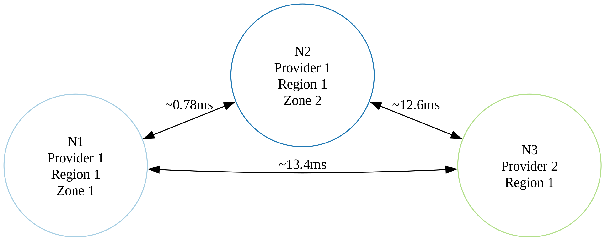
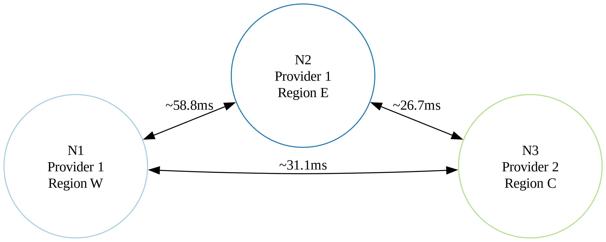
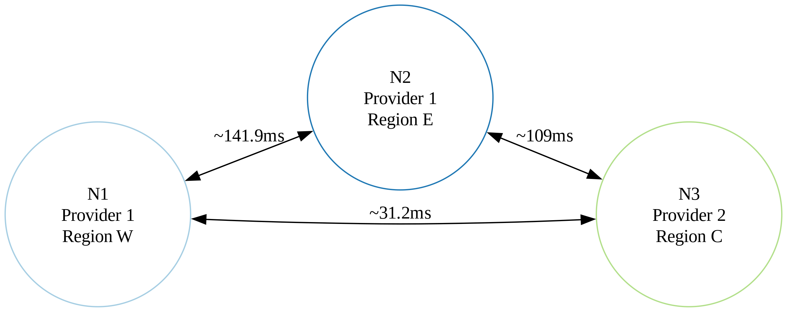
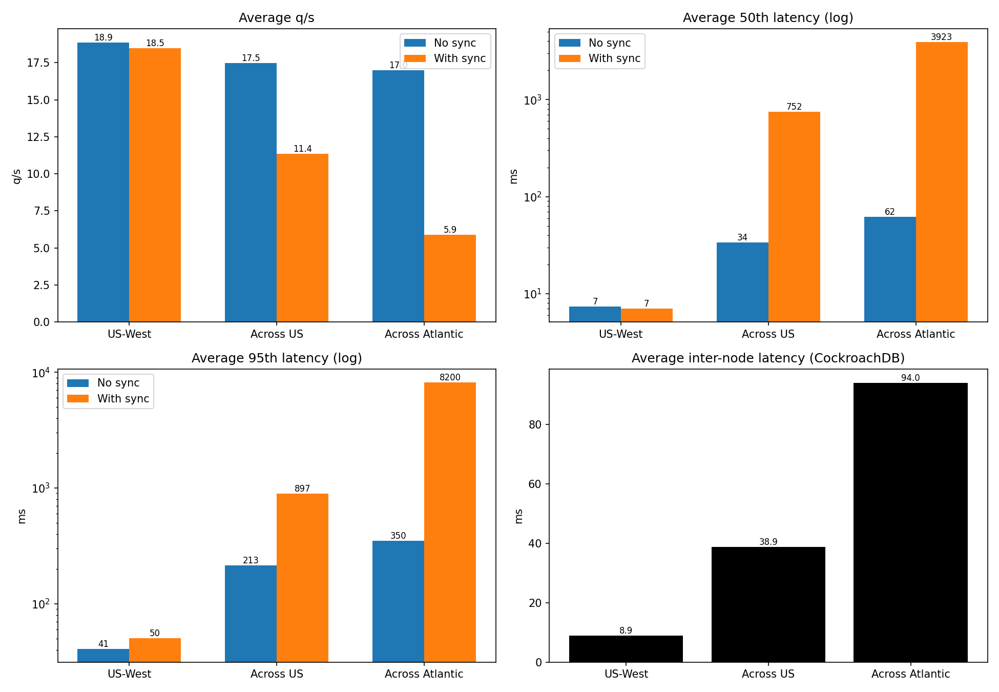

# Latency: Typical scenarios examples

This section showcases sample deployments, their latencies, and their results
on a specific test to serve as real-life reference examples. The importance of
latency is described in [this section](https://www.google.com/search?q=latency.md).

Notice that values here are only a snapshot when they have been run. DSS code
has and will improve in the future, cloud providers network resources will
evolve with time and even placement of your virtual machine could randomly
impact latency and performances.

All examples are run with version v0.22.0, one node per location, with virtual
machines with ample resources to focus on showing latency variations.
CockroachDB encryption was off to simplify tests.

Locust instances are always located next to the DSS being tested, on the same
machine. The test ran is:

```docker run -e AUTH_SPEC="DummyOAuth(http://172.17.0.1:8085/token,localhost)"  -p 8089:8089 -v .:/app/ interuss/monitoring-dev uv run locust -f loadtest/locust_files/ISA.py -H http://172.17.0.1 -u 10 --uss-base-url http://dss.localututm```.

The test has been chosen to be light and to be able to run it across a wide
number of configurations, with the possibility of adding one subscription to
force 'synchronization' between nodes. Others, more complex tests (like
FlightsInSubs which create one implicit subscription for each call) generate too
many contentions with version v0.22.0 to be meaningful.

## US-West

Cluster has been deployed on the west coast, in two providers. Regions between
providers are close, and the two machines in the same provider are in the same
region, but different availability zone.

Latency measured by CockroachDB is as follows:



Results after 2 minutes are:

| Node | q/s   | 50th latency | 95th latency |
| ---- | ----- | ------------ | ------------ |
| N1   | 19.35 | 2ms          | 11ms         |
| N2   | 19.01 | 3ms          | 14ms         |
| N3   | 18.2  | 17ms         | 97ms         |

showing good performances in general.

Notice primary CockroachDB node is probably located in 'Provider 1'. Other test
runs showed swapped latency, but that is to be expected.

With one subscription added in the database, forcing a synchronized update:

| Node | q/s   | 50th latency | 95th latency | Failures/s |
| ---- | ----- | ------------ | ------------ | ---------- |
| N1   | 19.1  | 2ms          | 17ms         | 0          |
| N2   | 18.81 | 3ms          | 14ms         | 0          |
| N3   | 17.53 | 16ms         | 120ms        | 0          |

While this shows a slight decrease in performance (approximately 2 percent for
q/s and 50th latency), the extra, synchronized step needed is almost invisible.

## Across US

Cluster has been deployed across the US, in two providers: one node in the west,
one node in the east and, in a different provider, in the center.

Latency measured by CockroachDB is as follows:



Results after 2 minutes are:

| Node | q/s   | 50th latency | 95th latency |
| ---- | ----- | ------------ | ------------ |
| N1   | 17.42 | 2ms          | 120ms        |
| N2   | 17.08 | 64ms         | 350ms        |
| N3   | 17.95 | 35ms         | 170ms        |

That's a 7% loss in performances, 700% increased latency for the 50th percentile
and more than 1000% of increase for the 95% percentile.

With one subscription added in the database, forcing a synchronized update:

| Node | q/s  | 50th latency | 95th latency | Failures/s |
| ---- | ---- | ------------ | ------------ | ---------- |
| N1   | 17.6 | 2ms          | 92ms         | 0          |
| N2   | 4.2  | 2200ms       | 2500ms       | 0          |
| N3   | 12.3 | 54ms         | 100ms        | 0          |

That's a 40% loss in performances, 24000% increased latency for the 50th
percentile and more than 6000% of increase for the 95% percentile, compared to
the same step in previous scenario.

The impact is way more visible there, as one is below 5q/s and very high
latency. CockroachDB leader still performs well.

## Across Atlantic Ocean

Cluster has been deployed across the US and in Europe, in two providers: one
node in the west, one in Europe and, in a different provider, in the center.

Latency measured by CockroachDB is as follows:



Results after 2 minutes are:

| Node | q/s  | 50th latency | 95th latency |
| ---- | ---- | ------------ | ------------ |
| N1   | 18.4 | 2ms          | 180ms        |
| N2   | 14.2 | 150ms        | 630ms        |
| N3   | 18.4 | 34ms         | 240ms        |

That's a 9% loss in performances, 1650% increased latency for the 50th
percentile and more than 2000% of increase for the 95% percentile.

With one subscription added in the database, forcing a synchronized update:

| Node | q/s  | 50th latency | 95th latency | Failures/s |
| ---- | ---- | ------------ | ------------ | ---------- |
| N1   | 10.4 | 570ms        | 4600ms       | 0.15       |
| N2   | 1.85 | 10000ms      | 10000ms      | 0.5        |
| N3   | 5.45 | 1200ms       | 10000ms      | 0.18       |

That's a 69% loss in performances, 122000% increased latency for the 50th
percentile and more than 35000% of increase for the 95% percentile, compared to
the same step in the first scenario. Compared to the non-synchronized case, we
lost about 63% of queries per second.

The DSS is almost unusable there, especially for locations without the
CockroachDB leader, but even direct queries to it are affected. Most queries in
Europe timeout.

## Summary



The DSS runs on a 3-node CockroachDB cluster, tested across 3 geographic setups.
The further apart the nodes, the higher the inter-node latency (8.9ms -> 38.9ms
-> 94ms), which directly hits performance. Without a synchronized step, the
impact stays moderate: q/s drops only ~7% (across US) to ~9% (Atlantic). But
once a synchronized operation is forced (adding a subscription), the gap
explodes with distance. In US-West it's invisible, coast-to-coast q/s falls ~40%
with 50th latencies around ~750ms, and across the Atlantic the system becomes
nearly unusable: average q/s down to ~6 (−69%), latencies capped at 10000ms, and
failures appearing only there (up to 0.5/s).

This test was done on endpoints performing relatively simple queries. More
complex ones, like SCD are even more affected.
