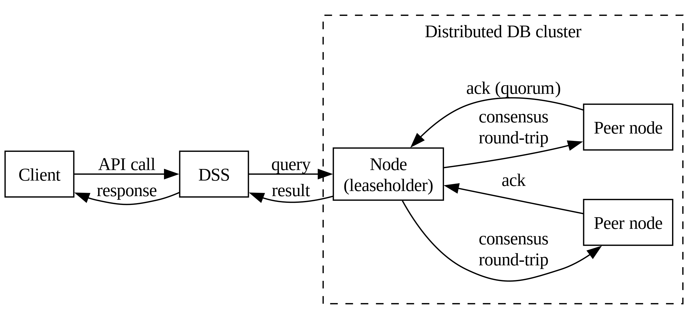
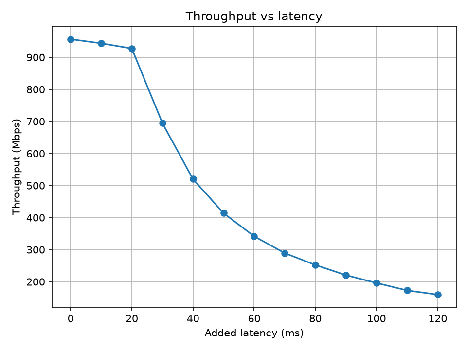
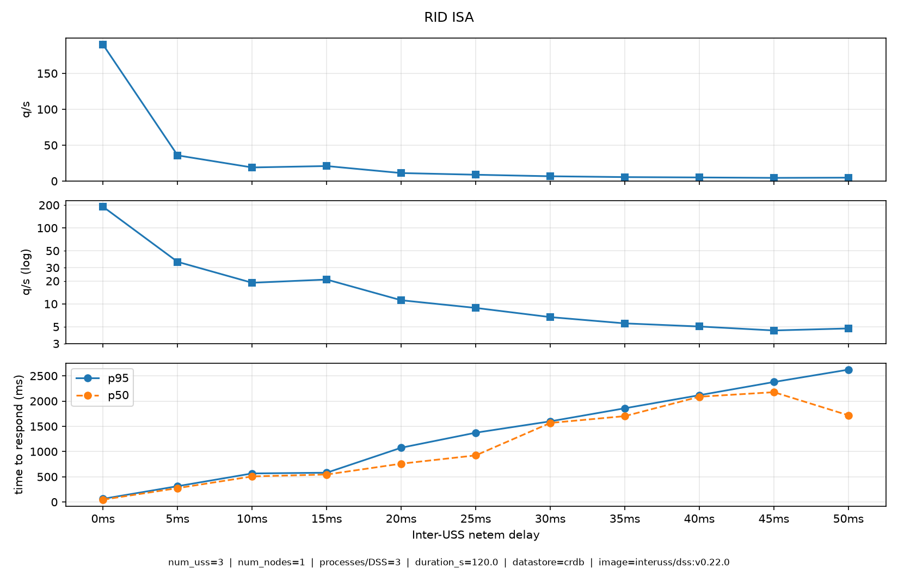

# Latency

The DSS keeps its data across all instances of a DSS pool using a single
distributed database cluster (e.g. CockroachDB, Yugabyte).

Because the cluster is distributed and strongly consistent, the physical
distance between nodes directly affects how fast the DSS can answer. Latency is
therefore not a detail: it drives the responsiveness and the throughput of the
whole service.

## Impact on performance

### Time to answer a request

When a call is made to the DSS, the core service queries the database. The
database is not a single node: it is a cluster spread across DSS participants.
To stay strongly consistent, a write must reach a quorum of nodes before it is
acknowledged, and a read may also need to contact other nodes depending on where
the data lives.

Each of these internal hops adds to the round-trip latency between nodes. A single
API call can trigger more than one database operation, so the latencies stack
up. If the nodes are far apart, every consensus round pays that distance, and
the time to answer grows accordingly.

/// caption
A generic request. Each
arrow adds cumulative latency
///

### Bandwidth

Latency and bandwidth interact. With high latency, each operation (assuming no parallelism) takes longer
to complete, so fewer operations finish per second, which lowers effective
throughput even when raw bandwidth is available. Synchronization traffic between
nodes also competes for that bandwidth.

This matters for high-volume cases such as many subscriptions or large query
results: the more data must be transferred and synchronized between distant
nodes, the more latency limits how much can realistically be moved in a given
time window. There is a practical ceiling on how much can be transferred before
responsiveness degrades.

/// caption
**Simulated** throughput vs
latency on a virtual link, practical throughput is even lower.
///

### Example of latency vs performance

The following graph shows, in a controlled environment, the impact of latency on
simple requests.

Tests have been done with DSS version v0.22.0, CockroachDB, 3 USS with one node,
on a virtual machine with ample resources.

Latency is injected with
`tc qdisc add dev eth0 root netem delay Xms 2ms distribution paretonormal` ([documentation](https://man7.org/linux/man-pages/man8/tc-netem.8.html)), with
X ranging from 0 to 50, in steps of 5ms. No loss is applied, nor latency between
a DSS and its datastore.

Performance is measured by creating and deleting RID ISAs, without any
subscriptions, as it performs simple queries and doesn't create congestion
issues.

Queries are done against all DSS, with 3 processes in parallel (for a total
of 9) and at the same time to remove as many variations as possible. Notice
there is still some expected variance, the goal here is to show global trends.

/// caption
Results of testing RID ISA calls with
various latencies.
///

This is just an example of one call, but it shows that even with a simple
operation, there is a limit on how fast queries can be processed, no matter
optimizations performed.

## Recommendations

Keep nodes as close as possible, ideally within the same region, to minimize the
round-trip cost of consensus and synchronization.

At the same time, you should probably keep distinct areas, datacenters and
providers for redundancy. A set of servers in a single rack will be very fast,
but have very low redundancy, for example if the rack loses power. On the
opposite side of the options, servers spread throughout the world will offer
maximum redundancy, for example against country-level issues, but will be very
slow. The goal is a balance: geographically close enough for low latency,
diverse enough for redundancy.

Think and plan for the failures you want to handle, as a pool, and then spread
nodes across failure domains accordingly for resilience.

## Typical scenarios

Examples of typical scenarios, along with their latencies and impacts on
performance, are shown in this [dedicated section](latency-examples.md).
