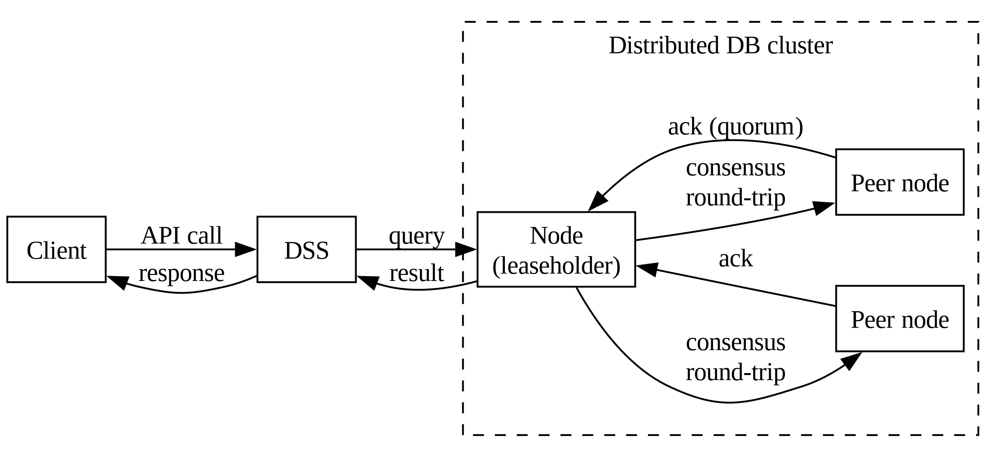
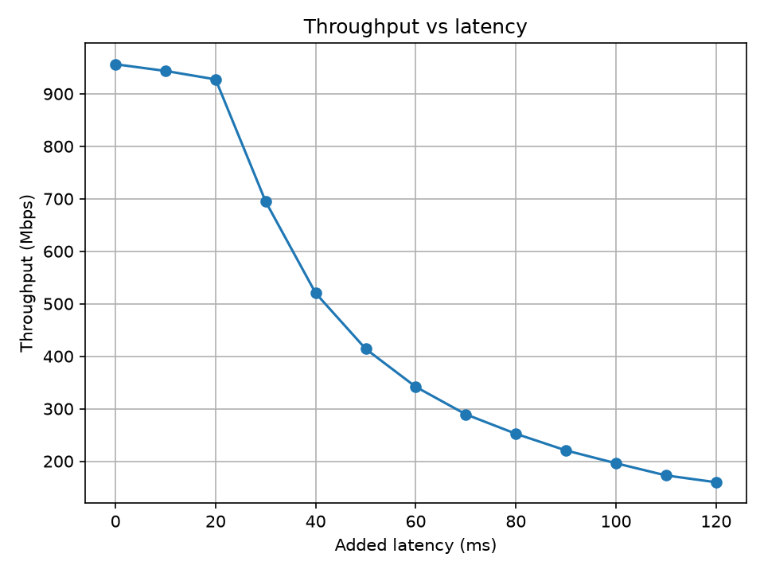
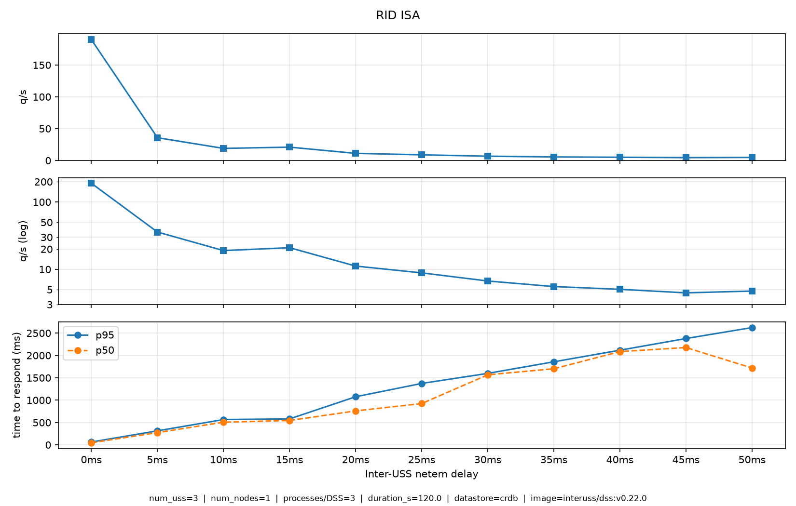
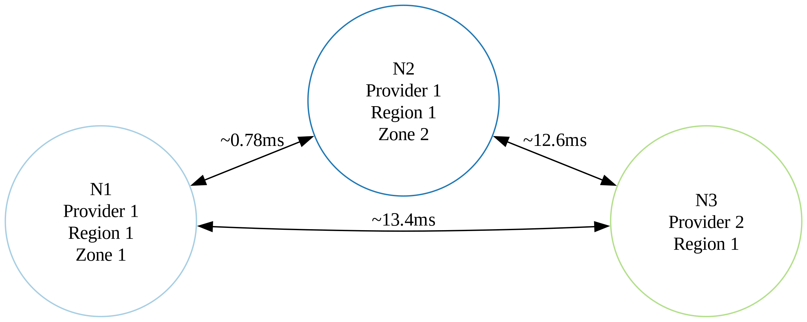
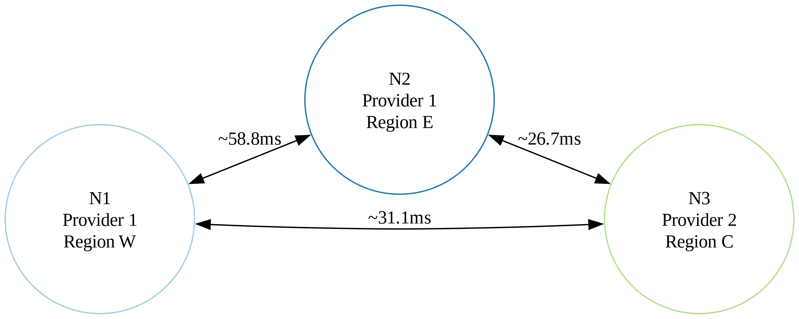
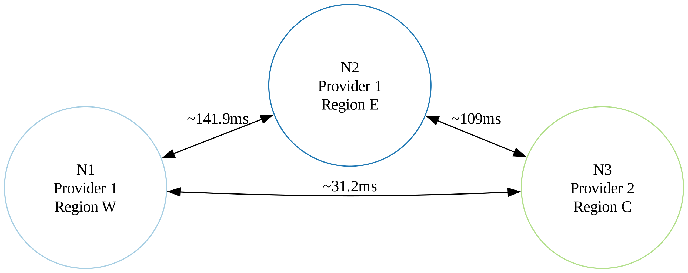
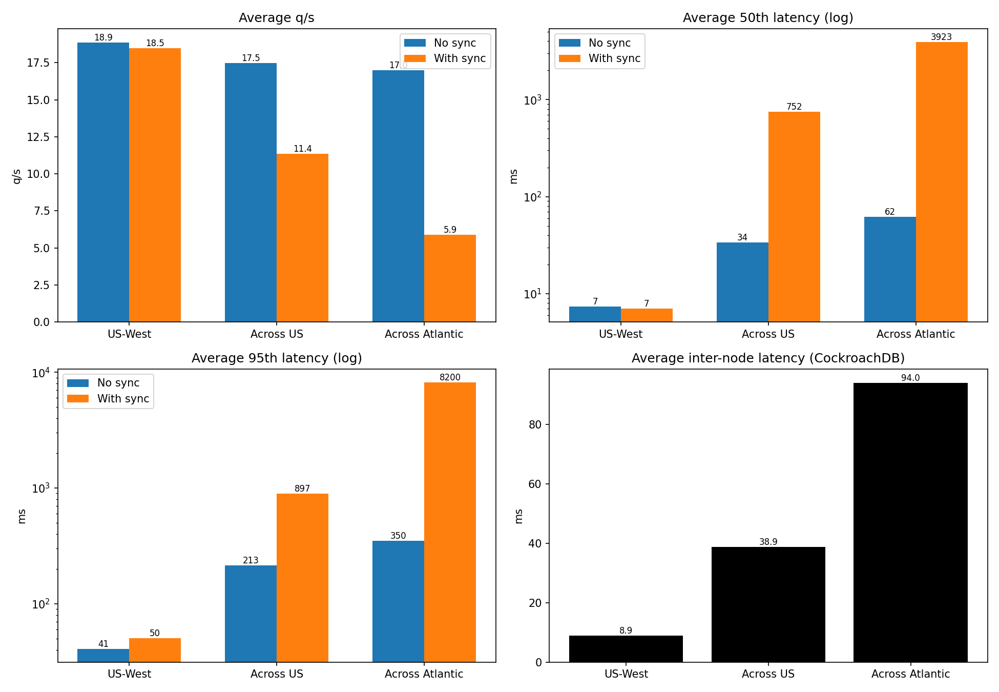

# Latency

The DSS keeps its data across all instances of a DSS pool using a single
distributed database cluster (e.g. CockroachDB, Yugabyte).

Because the cluster is distributed and strongly consistent, the physical
distance between nodes directly affects how fast the DSS can answer. Latency is
therefore not a detail: it drives the responsiveness and the throughput of the
whole service.

## Impact on performance

### Time to answer a request

When a call is made to the DSS, the core service queries the database. The
database is not a single node: it is a cluster spread across DSS participants.
To stay strongly consistent, a write must reach a quorum of nodes before it is
acknowledged, and a read may also need to contact other nodes depending on where
the data lives.

Each of these internal hops adds to the round-trip latency between nodes. A single
API call can trigger more than one database operation, so the latencies stack
up. If the nodes are far apart, every consensus round pays that distance, and
the time to answer grows accordingly.


/// caption
A generic request. Each
arrow adds cumulative latency
///

### Bandwidth

Latency and bandwidth interact. With high latency, each operation (assuming no parallelism) takes longer
to complete, so fewer operations finish per second, which lowers effective
throughput even when raw bandwidth is available. Synchronization traffic between
nodes also competes for that bandwidth.

This matters for high-volume cases such as many subscriptions or large query
results: the more data must be transferred and synchronized between distant
nodes, the more latency limits how much can realistically be moved in a given
time window. There is a practical ceiling on how much can be transferred before
responsiveness degrades.


/// caption
**Simulated** throughput vs
latency on a virtual link of a generic TCP connexion captured with [iperf3](https://software.es.net/iperf/), practical throughput is even lower.
///

### Example of latency vs performance

The following graph shows, in a controlled environment, the impact of latency on
simple requests.

Tests have been done with DSS version v0.22.0, CockroachDB, 3 USS with one node,
on a virtual machine with ample resources.

Latency is injected with
`tc qdisc add dev eth0 root netem delay Xms 2ms distribution paretonormal` ([documentation](https://man7.org/linux/man-pages/man8/tc-netem.8.html)), with
X ranging from 0 to 50, in steps of 5ms. No loss is applied, nor latency between
a DSS and its datastore.

Performance is measured by creating and deleting RID ISAs, without any
subscriptions, as it performs simple queries and doesn't create congestion
issues.

Queries are done against all DSS, with 3 processes in parallel (for a total
of 9) and at the same time to remove as many variations as possible. Notice
there is still some expected variance, the goal here is to show global trends.


/// caption
Results of testing RID ISA calls with
various latencies.
///

This is just an example of one call, but it shows that even with a simple
operation, there is a incompressible limit on how fast queries can be processed.

## Examples

This part showcases the effect of latency on a sample deployment to
illustrate the effects of latency.

!!! warning
    Notice that values here are only a snapshot from when they were run. DSS code
    has improved and will improve in the future, cloud providers' network resources
    will evolve with time, and even the placement of your virtual machine could
    randomly impact latency and performance.

    Results have to be interpreted relative to each other in various situations,
    not as the performance to be expected from the DSS.

    The performance baseline will be described in another document.

Locust instances are always located next to the DSS being tested, on the same
machine. The test ran is:

```docker run -e AUTH_SPEC="DummyOAuth(http://172.17.0.1:8085/token,localhost)"  -p 8089:8089 -v .:/app/ interuss/monitoring-dev uv run locust -f loadtest/locust_files/ISA.py -H http://172.17.0.1 -u 10 --uss-base-url http://dss.localututm```.

The test has been chosen to be light and to be able to run it across a wide
number of configurations, with the possibility of adding one subscription to
force 'synchronization' between nodes. Others, more complex tests (like
FlightsInSubs which create one implicit subscription for each call) generate too
many contentions with version v0.22.0 to be meaningful.

### Constraints: identifying the latency impact with a stable environment

These examples measure the impact of **latency alone**. Every environment
parameter is held constant across the three scenarios; the only variable is
geographic distance, and therefore inter-node latency. Any difference in the
results is attributable to that latency as much as
practically possible.

Held constant:

* **DSS version**: v0.22.0 in every run.
* **Topology**: one node per location, three nodes across two providers.
* **Machine resources**: ample CPU and memory; compute is never the bottleneck.
* **CockroachDB encryption**: off.
* **Client placement**: Locust runs on the same machine as the DSS under test,
  so client↔DSS latency is zero. Only *inter-node* latency varies.
* **Load profile**: the same light test, fixed at 10 users (`-u 10`), with no
  parallelization: each user sends one request, waits for the full response,
  then sends the next.
* **Datastore connections**: left to default value (4).

The serial load is what makes latency directly visible in throughput: each
user's rate is capped by the round-trip time, so once latency dominates, total
throughput falls as roughly `users / latency`. Read the q/s columns as a readout
of latency, not of DSS capacity.

### US-West

Cluster has been deployed on the west coast, in two providers. Regions between
providers are close, and the two machines in the same provider are in the same
region, but different availability zone.

Latency measured by CockroachDB is as follows:



Results after 2 minutes are:

| Node | q/s   | 50th latency | 95th latency |
| ---- | ----- | ------------ | ------------ |
| N1   | 19.35 | 2ms          | 11ms         |
| N2   | 19.01 | 3ms          | 14ms         |
| N3   | 18.2  | 17ms         | 97ms         |

showing good performances in general.

Notice primary CockroachDB node is probably located in 'Provider 1'. Other test
runs showed swapped latency, but that is to be expected.

With one subscription added in the database, forcing a synchronized update:

| Node | q/s   | 50th latency | 95th latency | Failures/s |
| ---- | ----- | ------------ | ------------ | ---------- |
| N1   | 19.1  | 2ms          | 17ms         | 0          |
| N2   | 18.81 | 3ms          | 14ms         | 0          |
| N3   | 17.53 | 16ms         | 120ms        | 0          |

While this shows a slight decrease in performance (approximately 2 percent for
q/s and 50th latency), the extra, synchronized step needed is almost invisible:
with nodes this close, the synchronization round-trip costs only a few
milliseconds.

### Across US

Cluster has been deployed across the US, in two providers: one node in the west,
one node in the east and, in a different provider, in the center.

Latency measured by CockroachDB is as follows:



Results after 2 minutes are:

| Node | q/s   | 50th latency | 95th latency |
| ---- | ----- | ------------ | ------------ |
| N1   | 17.42 | 2ms          | 120ms        |
| N2   | 17.08 | 64ms         | 350ms        |
| N3   | 17.95 | 35ms         | 170ms        |

That's a 7% loss in performances, 700% increased latency for the 50th percentile
and more than 1000% of increase for the 95% percentile. Without a synchronized
step, latency is still low enough that the client cadence, not latency, sets the
rate - hence the small q/s loss.

With one subscription added in the database, forcing a synchronized update:

| Node | q/s  | 50th latency | 95th latency | Failures/s |
| ---- | ---- | ------------ | ------------ | ---------- |
| N1   | 17.6 | 2ms          | 92ms         | 0          |
| N2   | 4.2  | 2200ms       | 2500ms       | 0          |
| N3   | 12.3 | 54ms         | 100ms        | 0          |

That's a 40% loss in performances, 24000% increased latency for the 50th
percentile and more than 6000% of increase for the 95% percentile, compared to
the same step in previous scenario.

The impact is way more visible there - and it is pure latency, not capacity: on
N2 the synchronized round-trip costs ~2200ms, and since each user must wait it
out before its next request, q/s falls to ~4 by simple arithmetic. The
CockroachDB leader (near N1) pays no such round-trip and keeps performing well.

### Across Atlantic Ocean

Cluster has been deployed across the US and in Europe, in two providers: one
node in the west, one in Europe and, in a different provider, in the center.

Latency measured by CockroachDB is as follows:



Results after 2 minutes are:

| Node | q/s  | 50th latency | 95th latency |
| ---- | ---- | ------------ | ------------ |
| N1   | 18.4 | 2ms          | 180ms        |
| N2   | 14.2 | 150ms        | 630ms        |
| N3   | 18.4 | 34ms         | 240ms        |

That's a 9% loss in performances, 1650% increased latency for the 50th
percentile and more than 2000% of increase for the 95% percentile.

With one subscription added in the database, forcing a synchronized update:

| Node | q/s  | 50th latency | 95th latency | Failures/s |
| ---- | ---- | ------------ | ------------ | ---------- |
| N1   | 10.4 | 570ms        | 4600ms       | 0.15       |
| N2   | 1.85 | 10000ms      | 10000ms      | 0.5        |
| N3   | 5.45 | 1200ms       | 10000ms      | 0.18       |

That's a 69% loss in performances, 122000% increased latency for the 50th
percentile and more than 35000% of increase for the 95% percentile, compared to
the same step in the first scenario. Compared to the non-synchronized case, we
lost about 63% of queries per second.

Here the cross-Atlantic synchronization round-trip approaches the request
timeout (10000ms): each serial user spends nearly the whole timeout waiting on
quorum, so throughput collapses and requests start to fail - the only scenario
with failures. This is the latency of synchronizing across an ocean, not a
limitation of the DSS: even the leader region (N1) is slowed purely by the cost
of reaching quorum. At this distance, synchronized operations are latency-bound
to the point of timing out, especially away from the leader.

### Summary



The DSS runs on a 3-node CockroachDB cluster, tested across 3 geographic setups
with **all environment parameters held constant** - version, topology, machine
resources, encryption, client placement, and the serial 10-user load. The only
variable is geographic distance, hence inter-node latency (8.9ms -> 38.9ms ->
94ms): every difference in the results is attributable to it, and under the
serial load, q/s is a direct readout of latency, not of DSS capacity.

The data shows:

* Without a synchronized step, latency stays below the client cadence, so q/s
  drops only ~7% (across US) to ~9% (Atlantic).
* With a synchronized step (one subscription), each request pays a consensus
  round-trip that grows with distance: invisible in US-West, ~750ms and −40%
  q/s coast-to-coast, and near the 10000ms timeout across the Atlantic - q/s
  down to ~6 (−69%), with failures (up to 0.5/s) appearing only there.

The conclusion is about latency, not the DSS. In no run is the DSS or database
saturated; they are waiting on quorum round-trips whose duration is set by
distance - ultimately by the speed of light - and no DSS or query optimization
can remove that.

Finally, this test was done on endpoints performing relatively simple queries.
More complex ones, like SCD, involve more synchronized steps per operation and
are therefore even more sensitive to inter-node latency.

## Conclusion

To minimize the round-trip cost of consensus and synchronization, keep nodes as
close as possible, ideally within the same region.

At the same time, you should probably keep distinct areas, datacenters and
providers for redundancy. A set of servers in a single rack will be very fast,
but have very low redundancy, for example if the rack loses power. On the
opposite side of the options, servers spread throughout the world will offer
maximum redundancy, for example against country-level issues, but will be very
slow. The goal is a balance: geographically close enough for low latency,
diverse enough for redundancy.

Think and plan for the failures you want to handle, as a pool, and then spread
nodes across failure domains accordingly for resilience.
