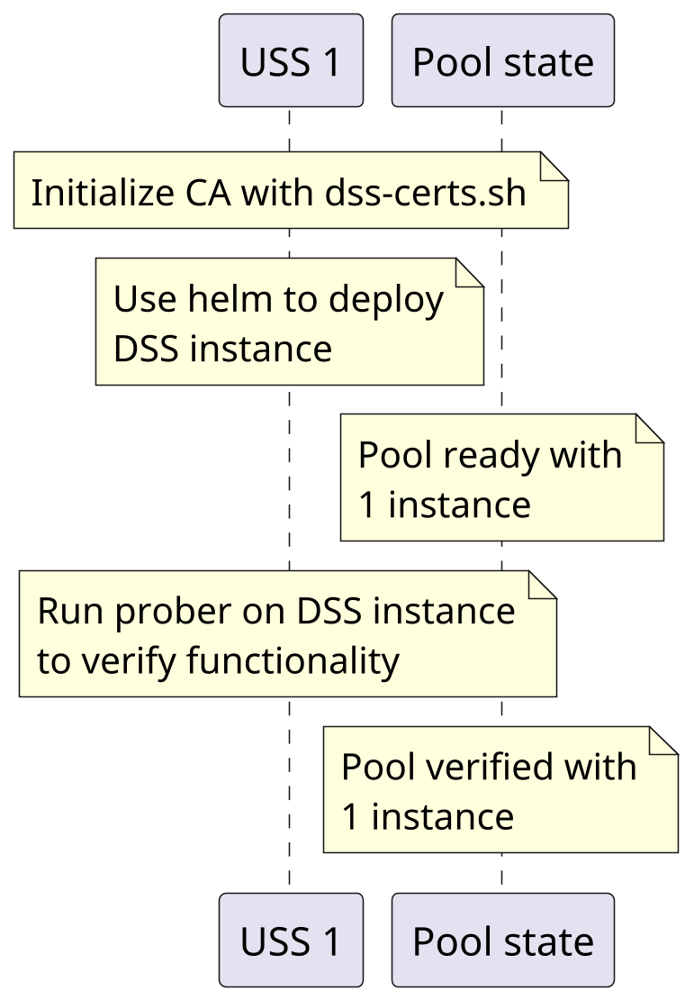
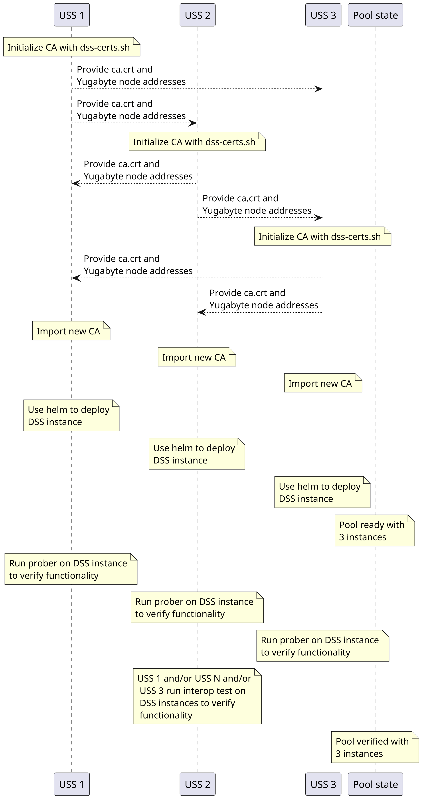
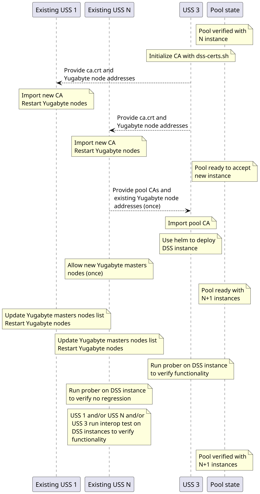

# DSS Pooling

This page provides background information on what pooling is and how it is
accomplished.  For pooling operational instructions, see
[deployment](../deployment/index.md).

## Introduction

The DSS is designed to be deployed in a federated manner where multiple
organizations each host a DSS instance, and all of those instances interoperate.
Specifically, if a change is made on one DSS instance, that change may be read
from a different DSS instance.  A set of interoperable DSS instances is called a
"pool", and the purpose of this document is to describe how to form and maintain
a DSS pool.

It is expected that there will be exactly one production DSS pool for any given
DSS region, and that a DSS region will generally match aviation jurisdictional
boundaries (usually national boundaries).  A given DSS region (e.g.,
Switzerland) will likely have one pool for production operations, and an
additional pool for partner qualification and testing (per, e.g.,
F3411-19 A2.6.2).

### Terminology notes

Some databases establish a distributed data store called a "cluster". This cluster
stores the DSS Airspace Representation (DAR) in multiple SQL databases within
that cluster.  This cluster is generally of many nodes of the database, potentially
hosted by multiple organizations.

Kubernetes manages a set of services in a "cluster". This is an entirely
different thing from the database cluster, and this type of cluster is what
the deployment instructions refer to. A Kubernetes cluster contains one or more
node pools: collections of machines available to run jobs. This node pool is an
entirely different thing from a DSS pool.

## Objective

A pool of InterUSS-compatible DSS instances is established when all of the
following requirements are met:

1. Each database node is addressable by every other database node
1. Each database node is discoverable
1. Each database node accepts the certificates of every other node
1. The database cluster is initialized

These requirements are met differently depending on the data store used:
- [YugabyteDB](./pooling-yugabyte.md)
- [CockroachDB](./pooling-crdb.md)

## Creating a new pool
All DSS instances are equal peers, and any set of DSS instance can be chosen to
create the pool initially. After the pool is established, additional DSS
instance can join it. After that joining process is complete, it can be
repeated any number of times to add additional DSS instances, though 7 is the
maximum recommended number of DSS instances for performance reasons. The
following diagram illustrates the pooling process for the first two instances:

Adding participant is illustrated below. Some actions marked with `(once)` need
to be run only once by one participant otherwise all participants in the current
pool must ran then.

### Establishing a pool with the first instance
The USSs owning the first DSS instances should follow
[the deployment instructions](../deployment/index.md).

### Joining an existing pool with new instance
A USS wishing to join an existing pool (of perhaps just one instance following
the prior section) should follow [the deployment instructions](index.md).
