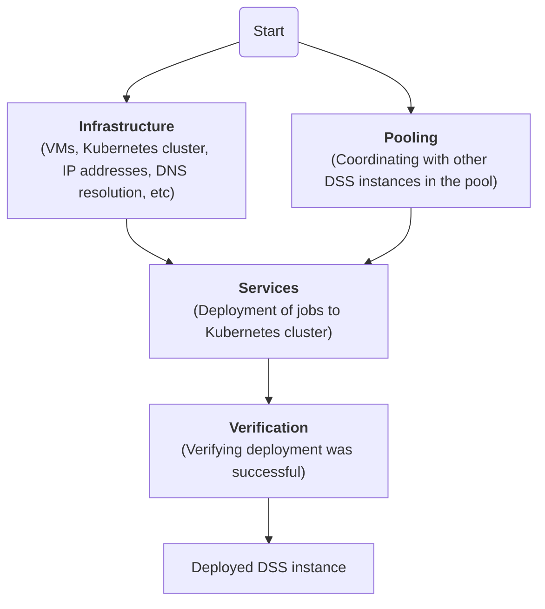

# Deployment of a DSS instance

An operational DSS deployment requires a specific architecture to be compliant with [standards requirements](https://github.com/interuss/dss?tab=readme-ov-file#standards-and-regulations) and meet performance expectations as described in [architecture background](../background/architecture.md).
This section describes the deployment procedures recommended by InterUSS to achieve this compliance and meet these expectations.

The deployment of a DSS instance involves four stages:

1. Provisioning the required cloud resources, in particular a Kubernetes cluster: [**Infrastructure**](./infrastructure/index.md).

1. Coordinating with other pool members (if any):  [**Pooling**](./pooling/index.md).

1. Deploying the DSS applications under the form of Kubernetes resources: [**Services**](./services/index.md).

1. Verifying the deployment was completed successfully and is fit for purpose: [**Verification**](./verification/index.md).

## Deployment Checklist

This checklist outlines the major decisions and steps required to deploy a non-local (e.g. production, qualification) DSS instance.

### Preparation

* [ ] Decide on the datastore you will use (CockroachDB or YugabyteDB). **All participants in a DSS Pool must use the same datastore**, so plan accordingly.
* [ ] Decide how and where you will deploy [the infrastructure](./infrastructure/index.md) of your DSS instances:
    * This repository provides Terraform configurations for [Amazon Web Services (EKS)](infrastructure/aws.md) and [Google Cloud (GKE)](infrastructure/google.md) to deploy a Kubernetes cluster (the infrastructure into which the Services will be deployed).
* [ ] Decide how and where you will deploy [the services](./services/index.md) of your DSS instances:
    * This repository provides [Tanka](https://github.com/interuss/dss/blob/master/deploy/services/tanka/) files and [Helm Charts](https://github.com/interuss/dss/blob/master/deploy/services/helm-charts/dss) to be used to deploy Services into a Kubernetes cluster. Terraform will automatically generate these configurations if needed.
* [ ] Prepare sufficient resources for the services.
    * In particular, review the [CockroachDB recommendations](https://www.cockroachlabs.com/docs/v24.1/recommended-production-settings#cloud-specific-recommendations) and [YugabyteDB recommendations](https://docs.yugabyte.com/stable/deploy/checklist/#public-clouds); the datastore will consume the majority of the resources.
    * Example sizing is also describled in [architecture](../background/architecture.md#sizing).

### Deployment

* [ ] Deploy the [infrastructure](./infrastructure/index.md) by following the guides based on your previous infrastructure choice.
* [ ] Define the [pool](./pooling/index.md) in which your DSS will operate.
* [ ] Deploy the [services](./services/index.md) by following the guides based on your previous services choice.
* [ ] [Verify](./verification/index.md) the DSS instance was deployed successfully and is fit for purpose.

### Operations

Once a DSS instance is deployed, its owner will need to [operate it](../operations/index.md) appropriately to meet requirements.

* [ ] Identify [operational procedures](../operations/index.md) that may be needed while operating the DSS instance.
* [ ] Ensure operating personnel are trained on all applicable operational procedures that may be needed.
