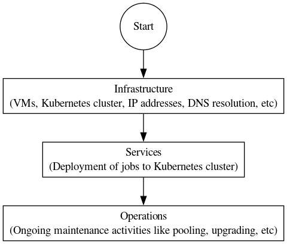

# DSS Deployment

## Introduction

An operational DSS deployment requires a specific architecture to be compliant with [standards requirements](../README.md#standards-and-regulations) and meet performance expectations as described in [architecture](./architecture.md).  This page describes the deployment procedures recommended by InterUSS to achieve this compliance and meet these expectations.

## Deployment layers

This repository provides three layers of abstraction to deploy and operate a DSS instance via Kubernetes.

As described below, InterUSS provides tooling for Kubernetes deployments on Amazon Web Services (EKS) and Google Cloud (GKE).
However, you can do this on any supported [cloud provider](https://kubernetes.io/docs/concepts/cluster-administration/cloud-providers/) or even on your own infrastructure.
Review [InterUSS pooling requirements](./architecture.md#objective) and consult the Kubernetes documentation for your chosen provider.

The three layers are the following:

1. [Infrastructure](./infrastructure) provides instructions and tooling to easily provision a Kubernetes cluster and cloud resources (load balancers, storage...) to a cloud provider. The resulting infrastructure meets the [Pooling requirements](./architecture.md#objective).
Terraform modules are provided for:
   - [Amazon Web Services (EKS)](infrastructure/modules/terraform-aws-dss)
   - [Google (GKE)](infrastructure/modules/terraform-google-dss)

1. Services provides the tooling to deploy a DSS instance to a Kubernetes cluster.
   - [Helm Charts](services/helm-charts/dss)
   - [Tanka](services/tanka)

1. [Operations](./operations) provides instructions to operate a deployed DSS instance.
   - [Pooling procedure](./operations/README.md#pooling-procedure)
   - [Troubleshooting](./operations/troubleshooting.md)

Depending on your level of expertise and your internal organizational practices, you should be able to use each layer independently or complementary.

For local deployment approaches, see the documentation located in the [build folder](../build/README.md#deployment-options)

## Getting started

You can find below two guides to deploy a DSS instance from scratch:
- [Amazon Web Services (EKS)](infrastructure/modules/terraform-aws-dss/README.md#Getting-started)
- [Google (GKE)](infrastructure/modules/terraform-google-dss/README.md#Getting-started)

For a complete use case, you can look into the configurations of the [CI job](../.github/workflows/dss-deploy.yml) in operations: [ci](operations/ci)

## Migrations and upgrades

Information related to migrations and upgrades can be found in [MIGRATION.md](MIGRATION.md).

## Development

The following diagram represents the resources in this repository per layer.

### Formatting

Terraform files must be formatted using `terraform fmt -recursive` command to pass the CI linter check.
