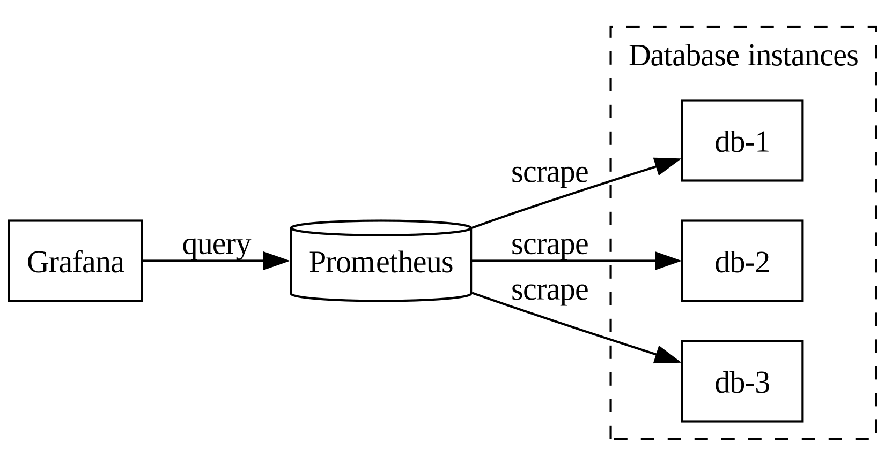
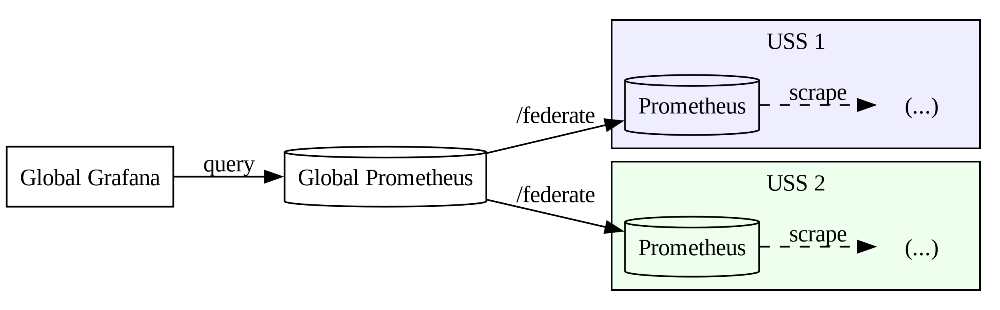

# Monitoring

## Prerequisites

Some of these [tools](../infrastructure/index.md#prerequisites) are required to interact with monitoring services.

## Grafana / Prometheus stack

When enabled, an instance of Grafana and Prometheus are deployed along with the
core DSS services; this combination allows you to view (Grafana) metrics
(collected by Prometheus).



This can be enabled via:

- The `enable_monitoring` option in terraform
- The `monitoring.enabled` option in helm
- By using tanka, which always enables it

### Grafana access

To access the Grafana interface, first ensure that the appropriate
cluster context is selected (`kubectl config current-context`). Then, run the
following command:

```shell
kubectl get pod | grep grafana | awk '{print $1}' | xargs -I {} kubectl port-forward {} 3000
```

While that command is running, open a browser and navigate to
[http://localhost:3000](http://localhost:3000).

The default username is `admin` with a default password of `admin` if using tanka, or a random value in a kubernetes secret named `<release>-grafana` if using helm charts.

Example to retrieve the secret in a default 'dss' release:

```shell
kubectl get secrets/dss-grafana -o jsonpath="{.data.admin-password}" | base64 -d
```

Click the magnifying glass on the left side to select a dashboard to view.

### Prometheus access

Prometheus access is protected by a client certificate. If you need to access the web interface, you will need to import a valid client certificate in your browser.

!!! info
    For day to day usage, you don't need to access Prometheus, use Grafana instead. This is only useful for debugging.

To build a pkcs12 file from a valid client certificate (use a random password):

=== "Yugabyte"
    ```
    openssl pkcs12 -export -inkey deploy/operations/certificates-management/workspace/demo/clients/client.grafana.key -in deploy/operations/certificates-management/workspace/demo/clients/client.grafana.crt  -out /tmp/cert_key.p12
    ```

=== "CockroachDB"
    ```
    openssl pkcs12 -export -inkey build/workspace/demo/client_certs_dir/client.grafana.key -in build/workspace/demo/client_certs_dir/client.grafana.crt -out /tmp/cert_key.p12
    ```

---

Then import this file as client certificate in your browser.

* Firefox: Preferences > Privacy & Security > View Certificates > Your Certificates > Import
* Chrome: Privacy and security > Security > Manage Certificates > Import

Next time you access the interface, select the certificate you just imported.

## Prometheus Federation (Multi Cluster Monitoring)

[Prometheus Federation](https://prometheus.io/docs/prometheus/latest/federation/)
enables you to easily monitor multiple clusters of the DSS that you operate,
unifying all the metrics into a single Prometheus instance where you can build
Grafana Dashboards. Enabling Prometheus Federation is optional.




To enable it, you need to do two things:

1. Externally expose the Prometheus service of the DSS clusters.
2. Deploy a "Global Prometheus" instance to unify metrics.

### Externally Exposing Prometheus

=== "Terraform managed"

    1. Set the option `prometheus_hostname` to the value of the public hostname that will be used to access your instance.
    2. Apply changes as usual, first by running terraform, and then tanka or helm

=== "Helm managed"

    1. Set `monitoring.externalService.enabled` to `true`
    2. [Optional] Set `monitoring.externalService.ip` set to a static external IP
    3. [Optional] Set `monitoring.externalService.subnet` if you use AWS.

=== "Tanka managed"

    1. Set `expose_external` to `true`
    2. [Optional] Supply a static external IP Address to `IP`

### Deploy "Global Prometheus" instance

1. Follow guide to deploy Prometheus https://prometheus.io/docs/introduction/first_steps/
2. The scrape rules for this global instance will scrape other prometheus `/federate` endpoints and are rather simple, please look at the [example configuration](https://prometheus.io/docs/prometheus/latest/federation/#configuring-federation) as a starting point.
3. You will need to enable a client certificate, as this is used to protect the endpoint.
    * This uses the same CAs in a cluster. You can use any generated certificate with all Prometheus instances in a cluster.
    * Copy the private (`client.grafana.key`), public (`client.grafana.crt`), and CA (`ca.crt`) keys and make them available to your Prometheus instance, next to the config. Folders are:

    === "Yugabyte"
        `deploy/operations/certificates-management/workspace/demo/clients/`

    === "CockroachDB"
        `build/workspace/demo/client_certs_dir/`

<ol start="4"><li>Add encryption to your config:

```
tls_config:
    ca_file:   ca.pem
    cert_file: client.grafana.crt
    key_file:  client.grafana.key

```

</li></ol>

## OpenTelemetry

[OpenTelemetry](https://opentelemetry.io/) is an open-source observability framework for cloud-native software.

You can enable it on the DSS server to get:

* Tracing for all queries
* A Prometheus endpoint with some metrics

Currently, this setting is not yet available in Terraform, Helm or Tanka.

!!! warning

    By default, when OpenTelemetry is enabled, the metrics service listens on all addresses.


### Metrics

Point any Prometheus server to the endpoint (by default on port 8079).

You can use the `--metrics_addr` flag to change the listening port and address.

No dashboard has been created yet, but one is planned.

### Tracing

Traces can be sent to any OpenTelemetry-compliant service. Self-hostable examples include [Jaeger](https://www.jaegertracing.io/), [OpenObserve](https://github.com/openobserve/openobserve), [Grafana Tempo](https://grafana.com/docs/tempo/latest/), and [SigNoz](https://github.com/SigNoz/signoz). Multiple SaaS solutions are also available (including some of the previously mentioned tools).

You need to use the `OTEL_EXPORTER_OTLP_ENDPOINT` environment variable to configure it. Point it toward your server by following its specific documentation.

[Other variables for telemetry](https://opentelemetry.io/docs/languages/sdk-configuration/otlp-exporter/) (and [variables in general](https://opentelemetry.io/docs/languages/sdk-configuration/general/)) supported by the Go language are available as well if needed.

As an example for local debugging, when using the local Docker Compose file, you can patch it as shown below to add a Jaeger server and point the DSS toward it.

```diff
diff --git a/build/dev/docker-compose_dss.yaml b/build/dev/docker-compose_dss.yaml
index e66d2ba4..d204104b 100644
--- a/build/dev/docker-compose_dss.yaml
+++ b/build/dev/docker-compose_dss.yaml
@@ -133,6 +133,7 @@ services:
       COMPOSE_PROFILES: ${COMPOSE_PROFILES}
       # Note: requires the Dockerfile to have been built with "-cover" in the EXTRA_GO_INSTALL_FLAGS var
       GOCOVERDIR: "/startup/coverdata"
+      OTEL_EXPORTER_OTLP_ENDPOINT: "http://jaeger:4317"
     command: /startup/core_service.sh ${DEBUG_ON:-0}
     ports:
       - "4000:4000"
@@ -178,6 +179,16 @@ services:
       start_period: 30s
       start_interval: 5s

+  jaeger:
+    image: jaegertracing/jaeger:2.14.0
+    ports:
+      - "16686:16686"
+      - "4317:4317"
+      - "4318:4318"
+      - "5778:5778"
+      - "9411:9411"
+    networks:
+      - dss_sandbox_default_network
 networks:
   dss_sandbox_default_network:
     name: dss_sandbox-default
diff --git a/build/dev/startup/core_service.sh b/build/dev/startup/core_service.sh
index f09bda59..8c96cf3e 100755
--- a/build/dev/startup/core_service.sh
+++ b/build/dev/startup/core_service.sh
@@ -44,5 +44,6 @@ else
   -enable_scd \
   -allow_http_base_urls \
   -locality local_dev \
-  -public_endpoint http://127.0.0.1:8082
+  -public_endpoint http://127.0.0.1:8082 \
+  -enable_opentelemetry
 fi
```
