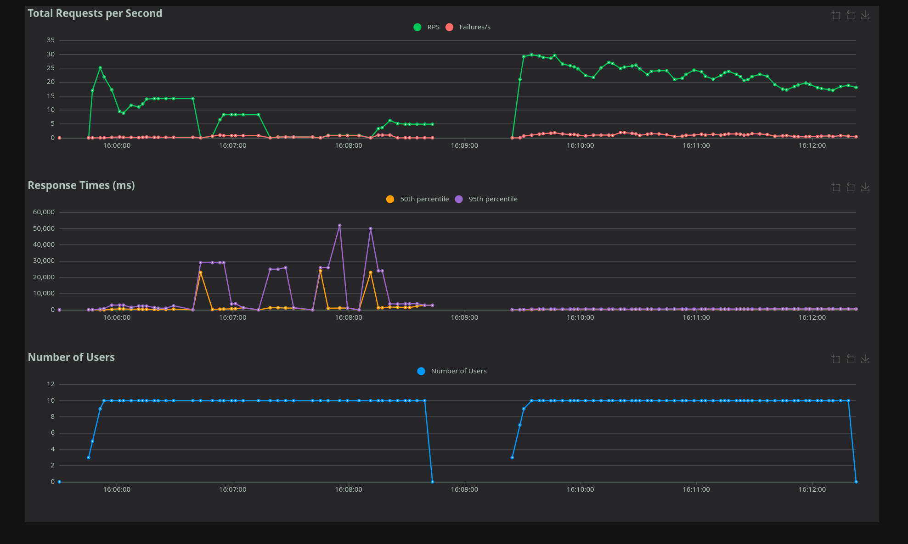
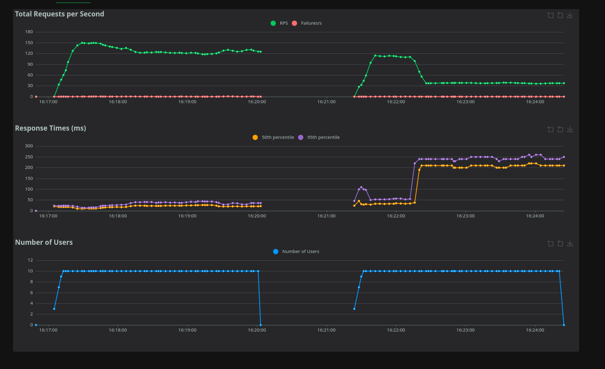

# Performance

## Entries accumulation

Overtime, old entries should be removed to ensure the system is not overloaded processing unrelevent data.

See the detailed [section about cleanup](cleanup.md).

## CPU and memory allocation

By default, the deployment tooling does not set any Kubernetes CPU or memory requests or limits on the CockroachDB and core-service containers.
Kubernetes may then place them on nodes without enough free memory and kill them when the node runs out of memory (see issue [#1731](https://github.com/interuss/dss/issues/1731)).

The following settings are available:

* CPU and memory requests and limits of the CockroachDB and core-service containers.
* CockroachDB `--cache` and `--max-sql-memory` flags (both `25%` by default). See [CockroachDB recommendations](https://www.cockroachlabs.com/docs/stable/recommended-production-settings#cache-and-sql-memory-size) before changing them.

To set them:

1. Set the values according to the deployment tool:

    === "Terraform"
        Set the following variables (see `TFVARS.gen.md` for details):

        * `crdb_resources`, e.g. `{ requests = { cpu = "3.5", memory = "14Gi" }, limits = { cpu = "3.5", memory = "14Gi" } }`
        * `crdb_cache` and `crdb_max_sql_memory`, e.g. `"25%"`
        * `core_service_resources`, e.g. `{ requests = { cpu = "0.5", memory = "2Gi" }, limits = { memory = "2Gi" } }`

        Then run `terraform apply` to regenerate the Tanka and Helm configuration.

    === "Tanka"
        Set the following fields of the metadata in your `main.jsonnet`:

        ```jsonnet
        cockroach+: {
          resources: { requests: { cpu: '3.5', memory: '14Gi' }, limits: { cpu: '3.5', memory: '14Gi' } },
          cache: '25%',
          maxSqlMemory: '25%',
        },
        backend+: {
          resources: { requests: { cpu: '0.5', memory: '2Gi' }, limits: { memory: '2Gi' } },
        },
        ```

    === "Helm"
        Set the following values:

        ```yaml
        cockroachdb:
          conf:
            cache: 25%
            max-sql-memory: 25%
          statefulset:
            resources: {requests: {cpu: "3.5", memory: 14Gi}, limits: {cpu: "3.5", memory: 14Gi}}
        dss:
          resources: {requests: {cpu: "0.5", memory: 2Gi}, limits: {memory: 2Gi}}
        ```

## The SCD global lock option

!!! danger
     All DSS instances in a DSS pool must use the same value for this option. Mixing will result in dramatically lower performance. See the [upgrades](upgrades.md#zero-traffic-upgrade-procedure) page for information on how to enable or disable these flags in an existing deployment.

     You can use the `/aux/v1/configuration/global_options` endpoint to retrieve the current value for a specifc DSS instance.

It has been reported in issue [#1311](https://github.com/interuss/dss/issues/1311) that creating a lot of overlapping operational intents may increase the datastore load in a way that creates timeouts.

By default, the code will try to lock on required subscriptions when working on operational intents, and having too many of them may lead to issues.

A solution to that is to switch to a global lock, that is just globally locking operational intents operations, regardless of subscriptions.

This will result in lower general throughput for operational intents that don't overlap, as only one of them can be processed at a time, but better performance in the issue's case as lock acquisition is simpler.

You should enable this option depending on your DSS usage/use case and what you want to maximize:
* If you have non-overlapping traffic and maximum global throughput, don't enable this flag
* If you have overlapping traffic and don't need high global throughput, enable this flag

The following graphs show example throughput without (on the left) and with the flag (on the right). This has been run on a local machine; on a real deployment you can expect lower performance (due to various latency), but similar relative numbers.

All graphs have been generated with the [loadtest present in the monitoring repository](https://github.com/interuss/monitoring/blob/main/monitoring/loadtest/README.md) using `SCD.py`.


*Overlapping requests. Notice the huge spikes on the left, as the datastore struggles to acquire locks.*


*Non-overlapping requests. Notice the reduction of performance on the right, with a single lock.*

## The SCD hash lock option

!!! danger
     All DSS instances in a DSS pool must use the same value for this option. Mixing will result in dramatically lower performance. See the [upgrades](upgrades.md#zero-traffic-upgrade-procedure) page for information on how to enable or disable these flags in an existing deployment.

     You can use the `/aux/v1/configuration/global_options` endpoint to retrieve the current value for a specifc DSS instance.

!!! danger
    This option requires migration 3.4.1 for CockroachDB and 1.1.1 for Yugabyte to be effective

Similar to the SCD global lock option, but use lock based on hashed cells (with 65k locks).

This should be better than global lock, as long as cells used don't collide and limit number of entries in the database.

The number of locks (65535) is a compromise between lock contention (the more locks, the less unrelated cells share the same one) and the size of the `scd_locks` table. It is fixed and cannot be changed.

Note that this flag creates intermittent load-sensitive test failures when used with Yugabyte. See PR [#1659](https://github.com/interuss/dss/pull/1659) for more details.

## The time-based notification index option

!!! danger
    All DSS instances in a DSS pool must use the same value for this option. Mixing them will result in undetermined behavior.  See the [upgrades](upgrades.md#zero-traffic-upgrade-procedure) page for information on how to enable or disable these flags in an existing deployment.

     You can use the `/aux/v1/configuration/global_options` endpoint to retrieve the current value for a specifc DSS instance.

Following the rationale described in issue [#1541](https://github.com/interuss/dss/issues/1541), this flag use a time-based system for notification indexes in SCD and RID.
Please check the details in the linked issue above and ensure you understand the consequences of enabling this flag, including the specific requirements you want or need to comply with.

## Combining the options

!!! danger
    The SCD global lock, SCD hash lock and time-based notification index options are mutually exclusive: at most one of them may be enabled.


## SCD lock diagnostics logs

To help diagnose latency spikes (for example as discussed in [#1311](https://github.com/interuss/dss/issues/1311)), the SCD subscription lock path emits targeted warning logs when a lock query looks expensive.

The warning is emitted when lock query duration is greater than or equal to `4s`.

The log message is `Expensive SCD lock detected` and includes:
* `global_lock`: Whether global lock mode is enabled for this query
* `duration`: Time spent executing the lock query
* `cell_count`: Number of S2 cells in the request
* `explicit_subscription_id_count`: Number of explicitly provided subscription IDs

Failed lock queries also emit warnings with timing and context:
* `SCD global lock query failed`
* `SCD subscription lock query failed`

These diagnostics are intended to keep normal logs low-noise while surfacing lock contention or unexpectedly large lock scopes.
