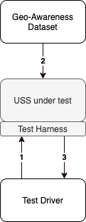

This folder contains information related to the design of the geo-awareness components of
the uss_qualifier automated testing suite.

## Architecture

Interactions between the uss_qualifier automated test driver and the USS under test are summarized in the diagram below.
The following steps are represented:
1. The test driver injects a reference to a Geo-Awareness dataset via the [Geo-Awareness test interface](../geo-awareness.yaml).
2. The USS under test loads the Geo-Awareness dataset. When ready, the USS under test responds to the injection request with the result of the loading process.
3. The test driver queries the USS under test via the test harness to validate that the USS successfully interprets the loaded dataset.

### Test groups

* U-Space
