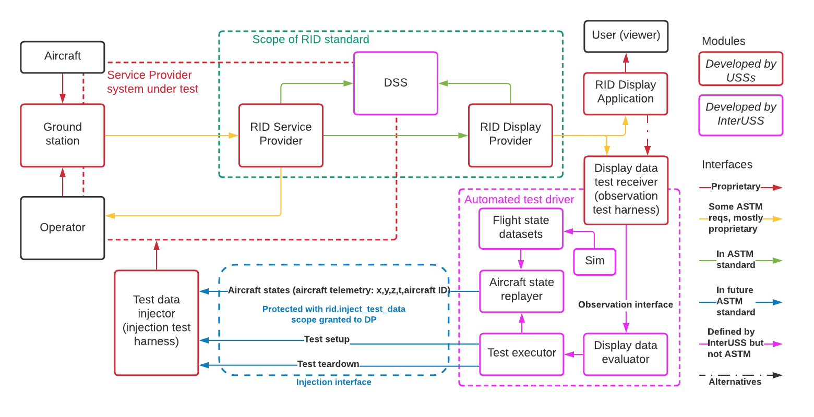

# Remote ID automated testing interfaces
These interfaces define how the remote ID automated testing suite interacts with
the system under test.

## Viewing locally
To view these YAML files locally:

```shell script
docker run -it --rm -p 8080:8080 \
  -v $(pwd)/observation.yaml:/usr/share/nginx/html/swagger.yaml \
  -e PORT=8080 -e SPEC_URL=swagger.yaml redocly/redoc
```

OR

```shell script
docker run -it --rm -p 8080:8080 \
  -v $(pwd)/injection.yaml:/usr/share/nginx/html/swagger.yaml \
  -e PORT=8080 -e SPEC_URL=swagger.yaml redocly/redoc
```

...then visit [http://localhost:8080/](http://localhost:8080/) in a browser.

## Architecture

The general architecture assumed by these interfaces looks like this:



In this diagram, the Service Provider system under test is encompassed by the
dotted red line.  Each Service Provider USS wishing to use the automated testing
system built with the interfaces in this folder would implement a **test data
injector** tailored to their individual system.  The automated test driver
would create a test by providing a set of test data for each participating SP
USS to inject into their system via the blue lines at the bottom of the diagram
-- these blue lines are the injection interface defined in this folder.  The SP
USS's test data injector would receive the injected data via that interface,
translate it into whatever form is necessary for their system, and cause it to
be injected into their system in whichever manner was most appropriate
(hopefully following as many of the same code paths true telemetry would
follow as possible).

Meanwhile, the automated test driver would poll a **display data test
receiver** implemented by a Display Provider to observe the remote ID
information currently available in the whole remote ID system under test.  A
Display Provider USS wishing to run the automated testing system built with the
interfaces in this folder would implement a display data test receiver tailored
to their individual system.  This display data test receiver would collect all
remote ID information available in a requested area, at the level of the Display
Application, and provide that information to the automated test driver via the
observation interface defined in this folder.

The automated test driver would perform a test by injecting test data into each
participating Service Provider, polling the resulting information from the
remote ID system via the display data test receiver, and checking that the
observed data satisfied a set of success criteria (e.g., an injected flight was
observed at the expected time, not observed at other times, had the right number
of recent positions, etc).
