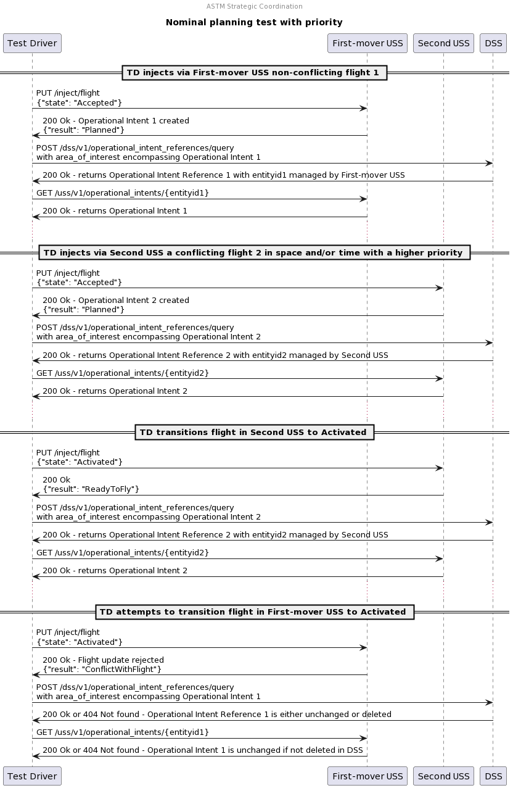

# Nominal planning test with priority

## Description

This test approximates normal strategic coordination where a user successfully
plans a flight whose operational intent is shared with other USSs, and where
another user takes priority over the first flight with an operational intent
with higher priority.

## Sequence

