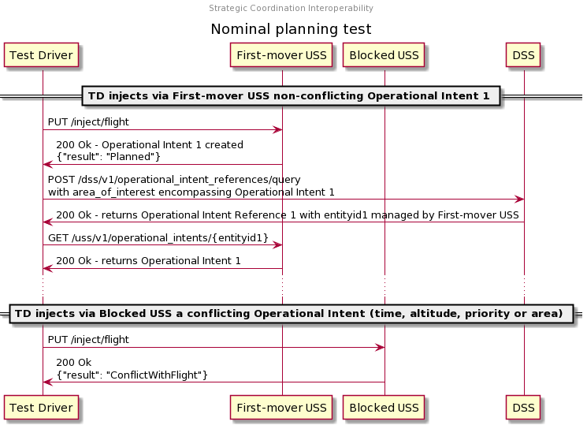

# Nominal planning test

## Description

This test approximates normal strategic coordination where a user successfully
plans a flight whose operational intent is shared with other USSs, and where a
user cannot plan a flight because it would conflict with another operational
intent.

## Sequence

