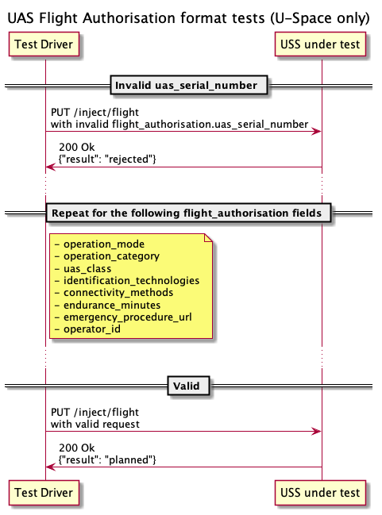

The tests in this group validate requirements unique to U-space flight
authorisations.

## Tests

### Data validation

This test attempts to create flights with invalid values provided for various
fields needed for a U-space flight authorisation, followed by successful flight
creation when all fields are valid.
