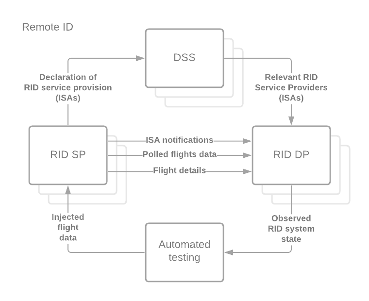
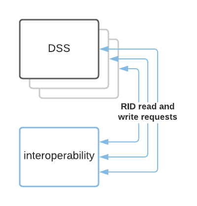
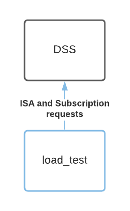
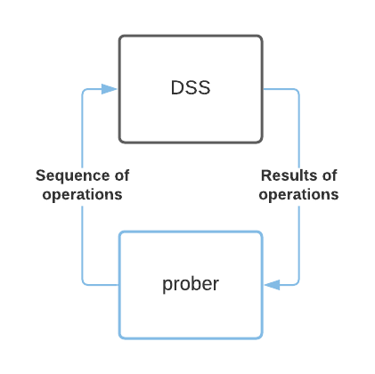
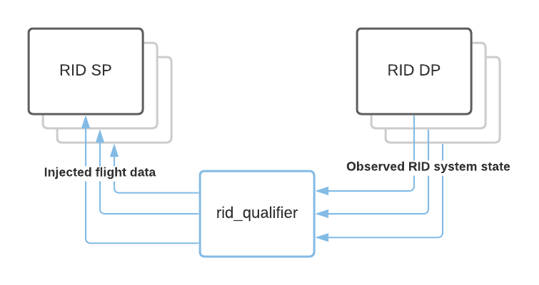
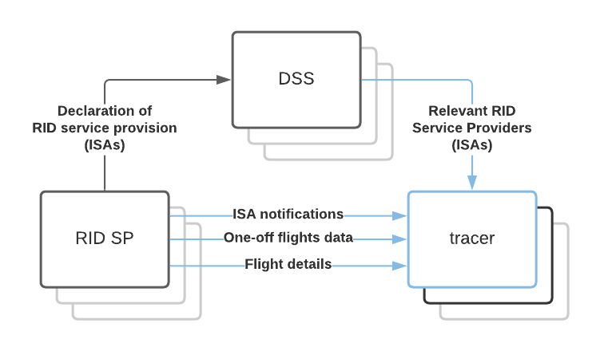
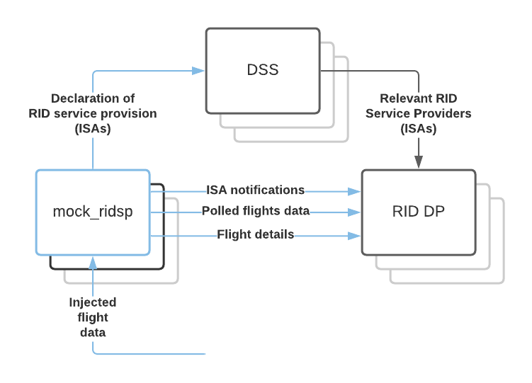
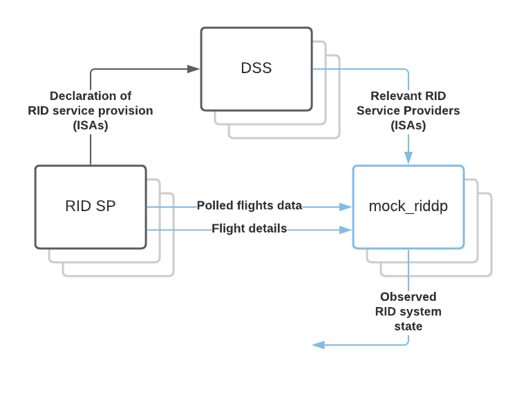
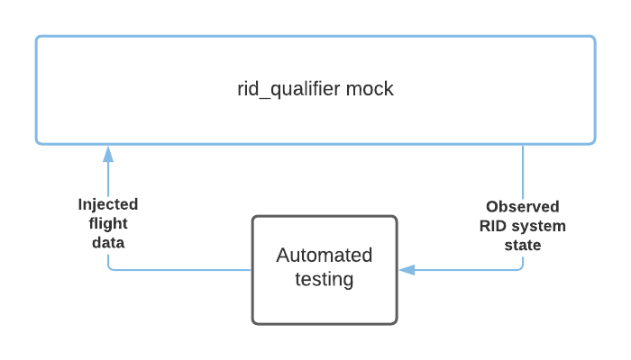

# Monitoring

This folder contains various tools to monitor, diagnose, and troubleshoot UTM
systems including DSS instances and systems that interact with DSS instances.

## Nominal system

When deployed normally in production, a remote ID ecosystem should look
like this:

The tools in this folder test, mock, or implement components of this system.

## Diagnostic tools

### interoperability

The [DSS interoperability test](interoperability) injects data into one DSS
instance and ensures it is visible on the other DSS instances.

### load_test

The [DSS load test](loadtest) sends a large number of concurrent requests to a
DSS instance to ensure it handles the load effectively.

### prober

[prober](prober) is an DSS integration test that performs a sequence of
operations on a single DSS instance and ensures that the expected results are
observed.

### rid_qualifier

[rid_qualifier](uss_qualifier/rid/README.md) is an automated test suite intended to verify
correct functionality of the entire RID ecosystem by injecting known test data
into one or more RID Service Providers, observing the resulting system state via
one or more RID Display Providers, and verifying that the expected results were
observed.  It is intended to be run in a production-like shared test environment
to verify the interoperability of all participants' systems before promoting
any system changes to production.

### tracer

[tracer](tracer) is a diagnostic tool that acts like an RID Display Provider in
order to collect and present information about the state of the system.  It is
not compliant with the data protection requirements of the ASTM RID standard and
therefore may not be used in any production systems.

## Mock systems

### dev DSS

The [dev DSS configuration](../build/dev) brings up a local development DSS
instance with [run_locally.sh](../build/dev/run_locally.sh), including a [Dummy
OAuth server](../cmds/dummy-oauth) which grants properly-formatted access tokens
(which can be validated against the
[test public key](../build/test-certs/auth2.pem)) to anyone requesting them.

### mock_ridsp

The [mock RID Service Provider](mock_ridsp) behaves like an RID Service Provider
which accepts input flight data (as would normally come from an operator) via
the
[InterUSS RID automated testing interface](../interfaces/automated-testing/rid)
injection API.

### mock_riddp

The [mock RID Display Provider](mock_riddp) behaves like an RID Display Provider
that makes remote ID information available to Display Application substitutes
via the
[InterUSS RID automated testing interface](../interfaces/automated-testing/rid)
observation API.

### uss_qualifier/rid/mock

The [rid_qualifier's mock](uss_qualifier/rid/mock) is a stand-alone test system that
presents the injection interfaces of one or more RID Service Providers along
with the observation interfaces of one or more RID Display Providers without the
need for any other dependencies (such as a DSS instance).  It is intended to
make uss_qualifier behavior easy to test.
