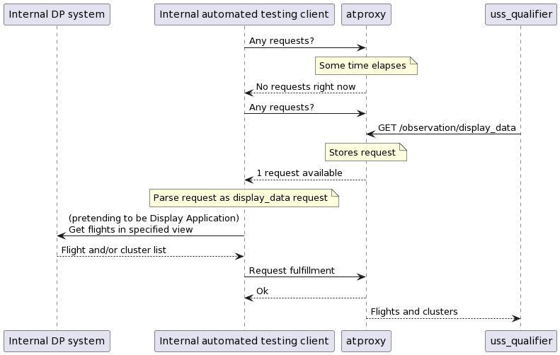

`atproxy` ("automated testing proxy") contains a proxy server to host automated
testing endpoints whose implementations are fulfilled by a client in a separate
environment.

## Motivation

For some USSs, exposing additional endpoints that interact with the internals of
their system can be a difficult and/or time-consuming process.  Since
uss_qualifier requires USSs under test to implement additional endpoints in
order to be tested, this means implementing automated testing can be difficult
for that reason.  atproxy attempts to reduce this difficulty by providing a
webserver implementing all USS endpoints required by uss_qualifier.  Whenever a
request arrives to one of these endpoints, the request is placed in a queue
which is accessible through handler endpoints.  Pending requests can be listed
by polling the appropriate handler endpoint, and then handled by writing to a
different handler endpoint.  The intended sequence of events to handle a
uss_qualifier call to GET /observation/display_data for RID testing is shown
below.

In this way, the "Internal automated testing client" (the USS's implementation
of required automated testing functionality) can be written using only outgoing
HTTP calls, and so is likely to be easier to integrate into the internal
environment.  atproxy can be hosted anywhere by the USS, including outside its
core systems.

## Usage

### Overview

atproxy must be hosted somewhere both uss_qualifier and the internal automated
testing client can access its endpoints.  This generally means it must be
exposed to the general Internet, but it does not need access to the USS's
internal systems.

Once atproxy is hosted, a USS must implement their own internal automated
testing client.  This client should poll atproxy for incoming requests, handle a
request internally, and then send the result back to atproxy (which will then
forward that result back to uss_qualifier).

### Setup

[`run_locally.sh`](run_locally.sh) provides a demonstration of the server in the
user's local environment.  The following parameters must be set appropriately
when running in a real environment:

* ATPROXY_PUBLIC_KEY: Public key to validate access tokens used to access automated testing endpoints, or a JWKS URL at which the public key is located.
* ATPROXY_TOKEN_AUDIENCE: Domain name (or comma-separated domain names) of the audience expected in access tokens used to access automated testing endpoints.
* ATPROXY_CLIENT_BASIC_AUTH: Username and password (in the form `username:password`) of HTTP Basic authentication used to access handler endpoints.

To access the handler endpoints (see [routes_handler.py](routes_handler.py)),
HTTP Basic authentication matching ATPROXY_CLIENT_BASIC_AUTH must be provided.

### Internal automated testing client

A USS's internal automated testing client should poll GET /handler/queries for
incoming queries.  When a query is found, it should be handled and then the
response written back to PUT /handler/queries/{query_id}.

The response format of GET /handler/queries is defined by
[ListQueriesResponse](routes_handler.py), and the format of the `request` field
depends on what automated testing endpoint is being queried (per `type` field).
The JSON request body of PUT /handler/queries/{query_id} should follow the
[PutQueryRequest](routes_handler.py) generally, and the format of the `response`
field should correspond to the request type.
