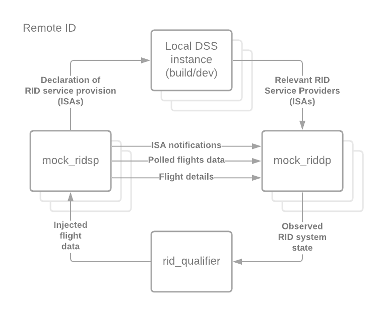

`mock_uss` contains mock implementations of a number of USS services.  It
provides a development-level web server that responds to requests to the USS
endpoints defined in the relevant ASTM standards in a standards-compliant
manner.

## Fully mocking an RID system

An entire remote ID ecosystem (as described in the diagram above) can be deployed on a single local machine by following the instructions below.

1. Deploy DSS instance, including Dummy OAuth server: from `build/dev`, run `./run_locally.sh`
1. Deploy mock RID Service Provider: from this folder, run `./run_locally_ridsp.sh`
1. Deploy mock RID Display Provider: from this folder, run `./run_locally_riddp.sh`
1. Run `uss_qualifier` configured to test this system: from `monitoring/uss_qualifier`, run `./run_locally.sh`
