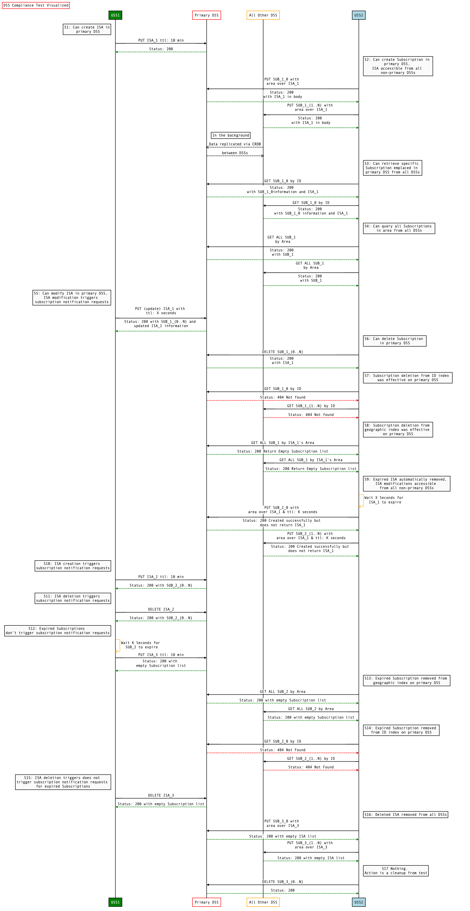

# ASTM F3411-19 NetRID DSS interoperability test scenario

## Overview

The test scenario in this folder verifies that two DSS instances implementing
the API required by ASTM F3411-19 in a shared DSS region  interoperate
correctly.  This is generally accomplished by performing an  operation on one
DSS instance and then verifying that the results are visible  in the other
instance.  Neither of the two DSS instances need to be an InterUSS Platform
implementation.

## Resources

### dss_instances

A resources.astm.f3411.DSSInstancesResource containing at least two DSS instances complying with ASTM F3411-19.  The first instance is the "Primary DSS" instance and the other instances are the "Other DSS" instances.

## Test sequence legend

* *P*: Primary DSS instance under test.  The sequence below is
  intended to be repeated so that each DSS is the primary DSS under test for one
  iteration of the sequence.
* *n*: Each of the other (non-Primary) DSS instances.
* ISA[*id*]: Reference to Identification Service Area with a particular test id
  (test id index, not full UUID identifier).  Note that the same UUID should be
  used for ISA[i] throughout the sequence even though the logical ISA may be
  created and deleted multiple times.
* Subscription[*id*]: Reference to Subscription with a particular test *id*
  (test id index, not full UUID identifier).  Note that the same UUID should be
  used for Subscription[i] throughout the sequence even though the logical
  Subscription may be created and deleted multiple times.
* D: Number of seconds needed to process requests to all DSS instances before
  the note to wait >D seconds from a particular time

## Interoperability sequence case

### S1 test step

Action: USS1@DSS*P*: PUT ISA with no start time and end time 10 minutes from now

Qualitatively proves: Can create ISA in primary DSS

#### ISA[*P*] created with proper response check

**astm.f3411.v19.A2-6-1,1a**

### S2 test step

Action: USS2@DSS*n*: PUT Subscription with intersecting area, no start time

Qualitatively proves: Can create Subscription in primary DSS, ISA accessible from all non-primary DSSs

#### Subscription[*n*] created with proper response check

**astm.f3411.v19.A2-6-1,3a**

#### service_areas includes ISA from S1 check

**astm.f3411.v19.A2-6-1,1c**

### S3 test step

Action: USS2@DSS*n*: GET Subscription[*P*] by ID

Qualitatively proves: Can retrieve specific Subscription emplaced in primary DSS from all DSSs

#### Subscription[*P*] returned with proper response check

**astm.f3411.v19.A2-6-1,5**

### S4 test step

Action: USS2@DSS*n*: GET Subscriptions using ISA[*P*]’s area

Qualitatively proves: All Subscription[i] 1≤i≤n are returned in subscriptions with proper response

#### Can query all Subscriptions in area from all DSSs check

**astm.f3411.v19.A2-6-1,6**

### S5 test step

Action: USS1@DSS*P*: PUT ISA[*P*] setting end time to now + D seconds

Qualitatively proves: ISA[*P*] modified with proper response, all Subscription[i] 1≤i≤n are returned in subscribers with proper response

#### Can modify ISA in primary DSS check

**astm.f3411.v19.A2-6-1,1b**

#### ISA modification triggers subscription notification requests check

**astm.f3411.v19.A2-6-1,3c**

### S6 test step

Action: USS2@DSS*P*: DELETE Subscription[*n*]

Qualitatively proves: Can delete Subscriptions in primary DSS

#### Subscription[*n*] deleted with proper response check

**astm.f3411.v19.A2-6-1,4a**

### S7 test step

Action: USS2@DSS*n*: GET Subscription[*n*] by ID

Qualitatively proves: Subscription deletion from ID index was effective from primary DSS

#### 404 with proper response check

**astm.f3411.v19.A2-6-1,4b**

### S8 test step

Action: USS2@DSS*n*: GET Subscriptions using ISA[*P*]’s area

Qualitatively proves: Subscription deletion from geographic index was effective from primary DSS

#### No Subscription[i] 1≤i≤n returned with proper response check

**astm.f3411.v19.A2-6-1,4b**

### S9 test step

Action: Wait >D seconds from S5 then USS2@DSS*n*: PUT Subscription with intersecting area, end time D seconds from now

Qualitatively proves: Expired ISA automatically removed, ISA modifications accessible from all non-primary DSSs

#### Subscription[*n*] created with proper response check

**astm.f3411.v19.A2-6-1,1c**

#### service_areas does not include ISA from S1 check

**astm.f3411.v19.A2-6-1,1d**

### S10 test step

Action: USS1@DSS*P*: PUT ISA with no start time and end time 10 minutes from now

Qualitatively proves: ISA creation triggers subscription notification requests

#### ISA[*P*] created with proper response check

**astm.f3411.v19.A2-6-1,1a**

#### All Subscription[i] 1≤i≤n returned in subscribers check

**astm.f3411.v19.A2-6-1,3b**

### S11 test step

Action: USS1@DSS*P*: DELETE ISA[*P*]

Qualitatively proves: ISA deletion triggers subscription notification requests

#### ISA[*P*] deleted with proper response check

**astm.f3411.v19.A2-6-1,2a**

#### All Subscription[i] 1≤i≤n returned in subscribers check

**astm.f3411.v19.A2-6-1,3c**

### S12 test step

Action: Wait >D seconds from S9 then USS1@DSS*P*: PUT ISA with no start time and end time 10 minutes from now

Qualitatively proves: Expired Subscriptions don’t trigger subscription notification requests

#### ISA[*P*] created with proper response check

**astm.f3411.v19.A2-6-1,1a**

#### None of Subscription[i] 1≤i≤n returned in subscribers check

**astm.f3411.v19.A2-6-1,3d**

### S13 test step

Action: USS2@DSS*n*: GET Subscriptions using ISA[*P*]’s area

Qualitatively proves: Expired Subscription removed from geographic index on primary DSS

#### No Subscription[i] 1≤i≤n returned with proper response check

**astm.f3411.v19.A2-6-1,3d**

### S14 test step

Action: USS2@DSS*n*: GET Subscription[*n*] by ID

Qualitatively proves: Expired Subscription removed from ID index on primary DSS

#### 404 with proper response check

**astm.f3411.v19.A2-6-1,3d**

### S15 test step

Action: USS1@DSS*P*: DELETE ISA[*P*]

Qualitatively proves: ISA deletion does not trigger subscription notification requests for expired Subscriptions

#### ISA[*P*] deleted with proper response check

**astm.f3411.v19.A2-6-1,2a**

#### None of Subscription[i] 1≤i≤n returned in subscribers with proper response check

**astm.f3411.v19.A2-6-1,3d**

### S16 test step

Action: USS2@DSS*n*: PUT Subscription with intersecting area, no start time

Qualitatively proves: Deleted ISA removed from all DSSs

#### Subscription[*n*] created with proper response check

**astm.f3411.v19.A2-6-1,3a**

#### service_areas includes ISA from S12 check

**astm.f3411.v19.A2-6-1,2b**

### S17 test step

Action: USS2@DSS*P*: DELETE Subscription[*n*]

#### Subscription[*n*] deleted with proper response check

**astm.f3411.v19.A2-6-1,4a**

## Sequence diagram

