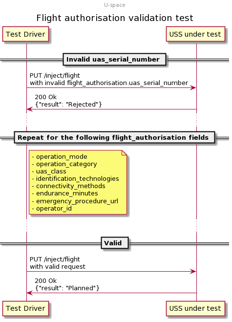

# Flight authorisation validation test scenario

## Description

This test attempts to create flights with invalid values provided for various
fields needed for a U-space flight authorisation, followed by successful flight
creation when all fields are valid.

## Sequence

## Resources

### flight_intents

FlightIntentsResource that provides at least two flight intents.  The last flight intent is expected to be valid and should be planned successfully.  All preceding flight intents must have some problem with the flight authorisation data such that they should be rejected.

### flight_planners

FlightPlannersResource that provides exactly one flight planner (USSP) which should be tested.

## Setup test case

### Check for necessary capabilities test step

USSP is queried for their capabilities to ensure this test can proceed.

#### Valid responses check

If the USSP does not respond appropriately to the endpoint queried to determine capability, this check will fail.

#### Support FlightAuthorisationValidation check

If the USSP does not support FlightAuthorisationValidation, then this check will fail.

### Area clearing test step

The USSP is requested to remove all flights from the area under test.

#### Area cleared successfully check

If the USSP does not respond appropriately or fails to clear the area of operations, this check will fail.

## Attempt invalid flights test case

### Inject invalid flight intents test step

uss_qualifier indicates to the first flight planner a user intent to create each of the invalid flight intents expecting the flight planner to reject each of these intents.

#### Incorrectly planned check

Each of the attempted flight intents contains invalid flight authorisation data.  If the USSP successfully plans the flight, it means they failed to detect the invalid flight authorisation.  Therefore, this check will fail if the USS indicates success in creating the flight from the user flight intent.

#### Failure check

Although the flight authorisation data is invalid, it is properly formatted and should allow the USSP to process it and reject the flight rather than causing a failure.  If the USS indicates that the injection attempt failed, this check will fail.

## Plan valid flights test case

### Inject valid flight intent test step

uss_qualifier indicates to the flight planner a user intent to create a valid flight.

#### Successful planning check

All flight intent data provided is correct and valid and free of conflict in space and time, therefore it should have been planned by the USS.  If the USSP indicates a conflict, this check will fail.  If the USSP indicates that the flight was rejected, this check will fail.  If the USSP indicates that the injection attempt failed, this check will fail.

## Cleanup

### Successful flight deletion check

Per **[scd.yaml::DeleteFlightSuccess](../../../../../interfaces/automated-testing/scd/scd.yaml)**, the deletion attempt of the previously-created flight should succeed for every flight planner under test.
