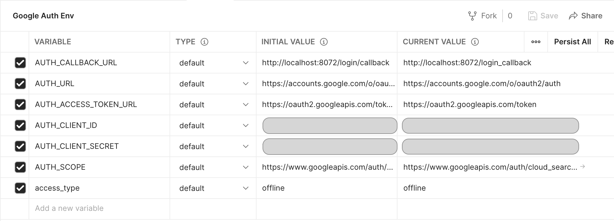
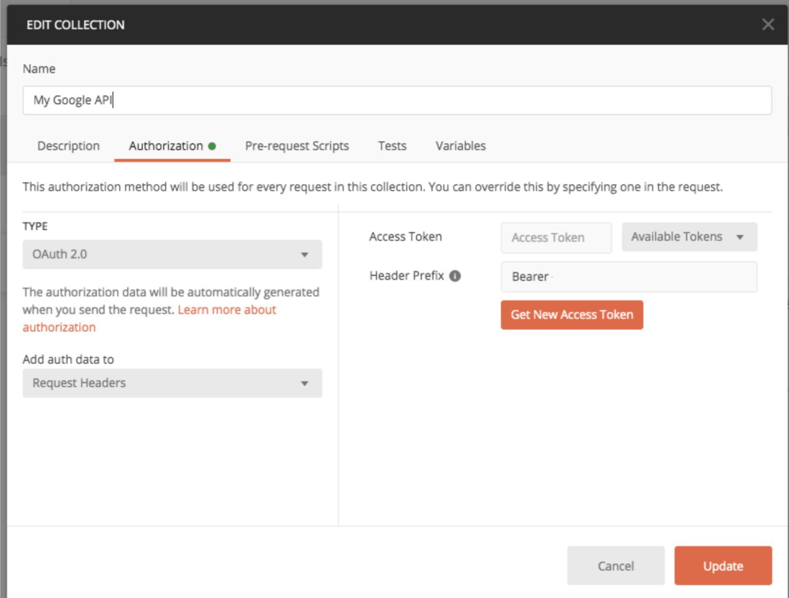
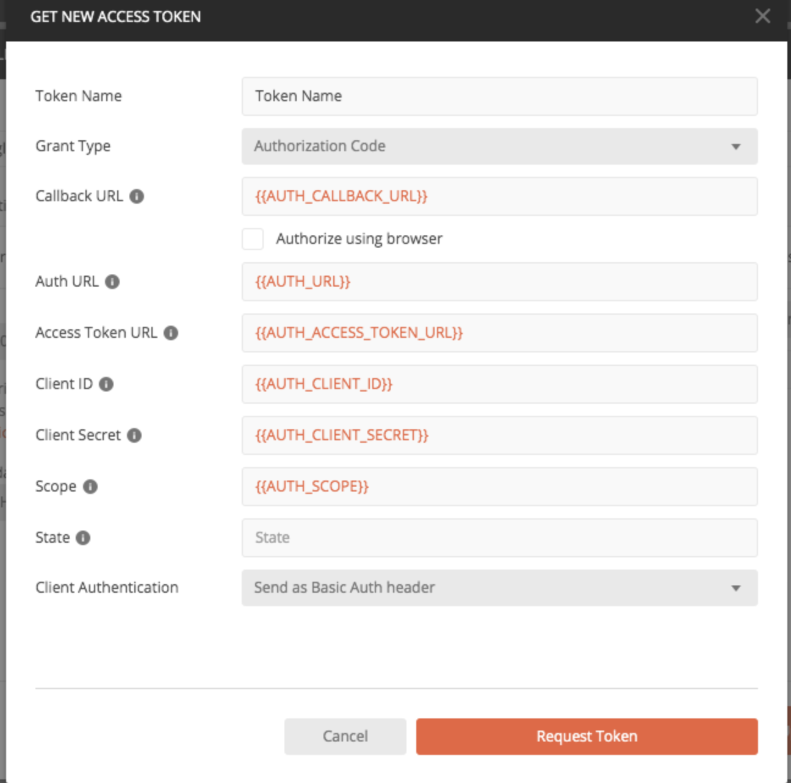
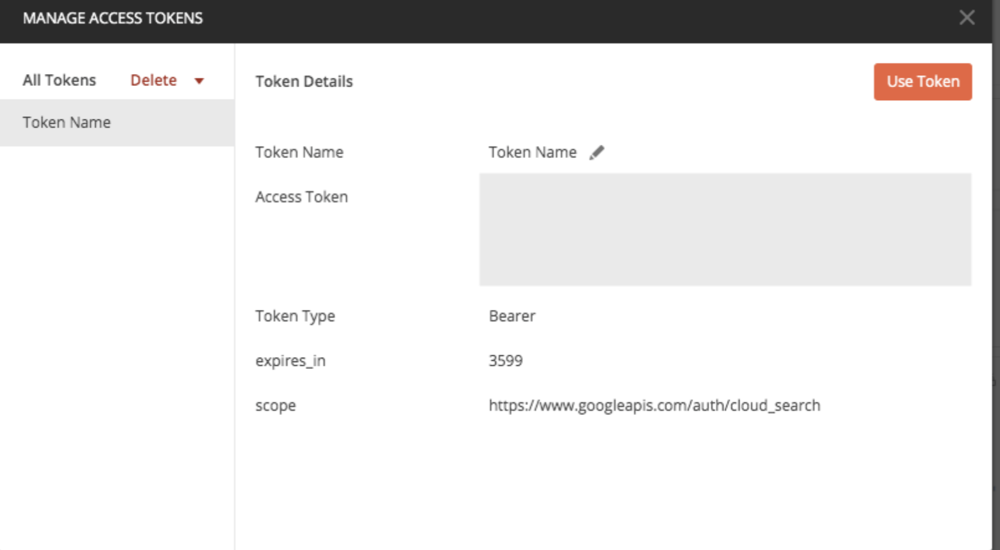
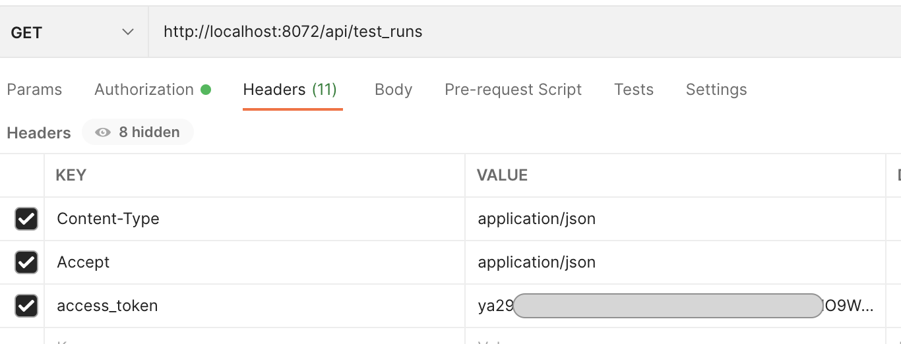

# Configuring Postman with OAuth 2 and client credentials

Postman can be configured to trigger the OAuth 2 flow and use a generated bearer token in all of your requests.

Follow the [instructions](LOGIN.md) to create and save OAuth2 credentials from Google Cloud Console if it is not done yet.

In Postman create a new environment for your credentials as shown below:

Once defined, these variables can be used in your Authorization tab in Postman. This can be configured at the collection level, the folder level or even the individual request level.

Click on “Get New Access Token” button.

If everything is configured correctly, clicking on "Request Token" will prompt you to Google Sign In screen.

Login using your Google credentials and you should see that a access token has been generated for you.

Copy this access_token and add this in header of your requests under the key name `access_token`

