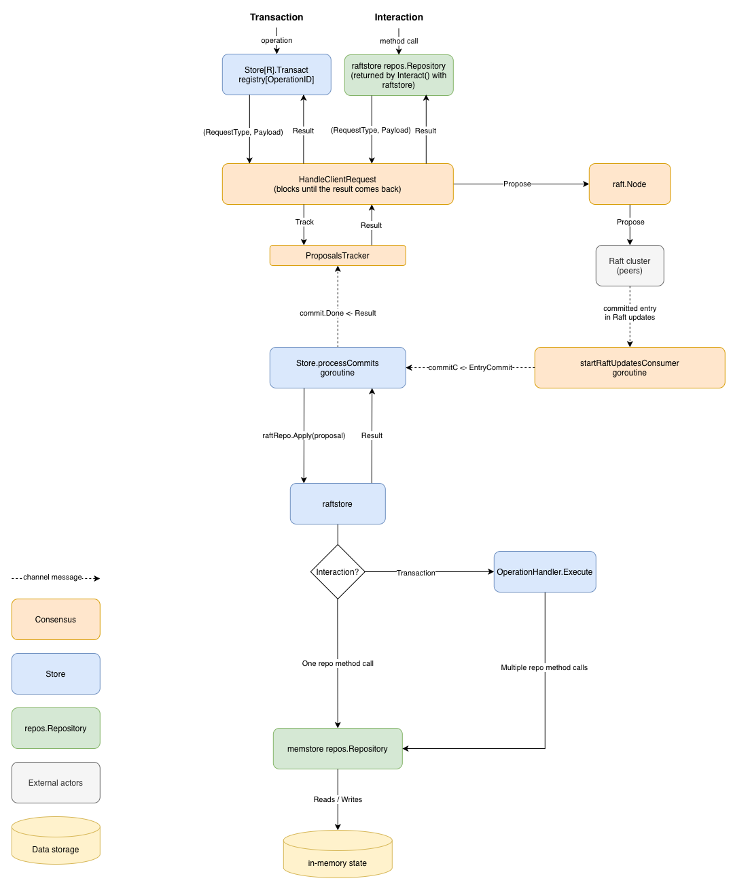

# raftstore

`pkg/raftstore` contains the Raft based store implementation. It lets a service replicate its state across a cluster of DSS nodes using [etcd's `raft`](https://pkg.go.dev/go.etcd.io/raft/v3) library for consensus.

## Key assumptions

- **Single Raft group:** Each service (aux, rid, scd) is backed by exactly one Raft group (one [`Consensus`](consensus/consensus.go) instance). There is no sharding or partitioning of data across multiple groups for now.
- **Persistent log:** The Raft log and snapshots are durable: each node writes its entries to a [write-ahead log (WAL)](https://pkg.go.dev/go.etcd.io/etcd/server/v3/storage/wal) and periodically persists snapshots to disk ([consensus/storage.go](consensus/storage.go)), so a node can restart and rejoin the cluster by replaying its own WAL. The log consists of a series of Raft proposals (see the data model section below), and snapshots are serialized representations of the in-memory store.
- **In-memory data projection:** The application state machine derived from the committed log (i.e. ISAs, subscriptions, operational intents, etc.) lives in-memory. It is not persisted but rather reconstructed by replaying the log / snapshot on startup.
- **Data model:** Each service (`rid`, `scd`, `aux_`) defines its own request/response structs. During replication, they are wrapped in a [`Proposal`](consensus/proposal.go), which carries metadata (an ID, the originating node, and a timestamp for determinism) with a `RequestType` string and a request payload as a serialized `Value`. [`pkg/raftstore/store.go`](store.go) replicates the `Proposal` through Raft and, once committed, the service specific raftstore implementation interprets `RequestType`/`Value` and applies the resulting change to its own in-memory store.

## Terminology

Most of the concepts defined below come from the Raft consensus algorithm itself, described in ["In Search of an Understandable Consensus Algorithm" by D. Ongaro and J. Ousterhout](https://raft.github.io/raft.pdf). Please refer to the original paper for more details on how the Raft protocol works although the definitions in this documentation aim to be self-contained.

### Actors

- **Raft group:** A set of Raft nodes that replicate one Raft log via the Raft consensus protocol (one leader and its followers).
- **Raft Node:** One participant in a Raft group, identified by a unique `NodeID`. One [`Consensus`](consensus/consensus.go) instance wraps one Raft node.
- **DSS Node:** One running core-service. Each DSS Node runs 3 Raft nodes (aux, rid, scd).
- **Peer:** Another Raft node in the same Raft group, reachable over `rafthttp` at a configured URL. Peers exchange Raft messages (votes, log replication, heartbeats) with each other.
- **Client:** An entity sending requests to a DSS node (e.g. via the REST ASTM API).
- **Leader / follower / candidate:** The three roles a Raft node can have. The leader is the only node that accepts client proposals and replicates them to the rest of the group. A follower passively replicates the leader's log and, if it stops hearing from the leader within its election timeout, becomes a candidate and starts an election to become the new leader.

### Raft log

- **Term:** A monotonically increasing number that identifies a "leadership epoch". It is incremented on every election.
- **Log:** The ordered, append-only sequence of entries maintained by Raft. It is the source of truth from which the application state machine is derived. The Raft algorithm makes sure every node's log ends up identical.
- **Entry:** An item of the log with a given index and term. An entry can be a normal entry carrying a Proposal or a configuration change entry, which alters cluster membership instead of application state.
- **Proposal:** The data being replicated through a normal entry (see [`consensus/proposal.go`](consensus/proposal.go)).
- **Proposing:** The act of a node asking Raft to append a Proposal to the log (`node.Propose`). Proposing does not mean it's been accepted yet. It still has to be committed.
- **Committed entry:** An entry becomes committed once a quorum (majority) of nodes has durably persisted it. `node.Ready()` surfaces newly committed entries so the node can act on them.
- **Applied entry:** An entry transitions from being committed to applied once the node has executed its effects on its state (application or configuration state).

### Raft State

- **(Application) State Machine:** In this codebase, each service (`rid`, `scd`, `aux_`) runs its own state machine (one per Raft group):
  - **State:** The service's in-memory data projection (ISAs, subscriptions, operational intents etc.).
  - **Input:** The entries committed by that service's Raft group, each carrying one `Proposal`.
  - **Transition:** The service business logic that, given the current state and one committed entry, interprets its `RequestType`/`Value` and deterministically applies the operation to the state (e.g. deleting a subscription).

  Because the transition is deterministic, replaying the same sequence of entries from the same starting state always produces the same final state on every node in the group, so any non-deterministic value (a timestamp, a generated UUID) shall be decided once by the proposer and carried inside the `Proposal`.
- **Snapshot:** A serialized copy of the application state at a given point in time.
- **WAL (write-ahead log):** The on-disk files a node uses to persist its Raft log entries before they're considered durable.

## Architecture

<p align="center">
  
  <br>
  <em>Overall architecture and request path through the Store and Consensus layers.</em>
</p>

### The repo layer

Each service (`rid`, `scd`, `aux_`) defines its own `repos.Repository` interface (e.g.
`pkg/rid/repos`) describing the basic operations needed from storage (`GetSubscription`,
`InsertSubscription`, `DeleteSubscription`...). Every storage backend (`sqlstore`, `raftstore`, `memstore`) implements it.

The `memstore` holds the data and `raftstore` is the replication layer that wraps it:

- The `memstore` `repos.Repository` ([pkg/memstore/store.go](../memstore/store.go)) is the most basic implementation. It holds data in-memory and every interface method call directly reads from or mutates it.
- The `raftstore` `repos.Repository` does not hold application data itself. It embeds a
`memstore.Store[R]` instance, which is where the data lives:
  ```go
  type repo struct {
      consensus *consensus.Consensus
      memStore  *memstore.Store[R]
  }
  ```
  Since individual `repos.Repository` method calls still need strong consistency guarantees, the `raftstore` `repos.Repository` implementations issue a request to be replicated by Raft.
  Once the proposal for that call has been committed, `raftstore`'s `Apply`
  (`raftstore.RaftRepo[R].Apply`) calls `r.memStore` for the data reads and writes.

### The Store layer: `Interact` and `Transact`

Above the repo layer, every backend implements the [`store.Store[R]`](../store/store.go) interface:

```go
type Store[R any] interface {
    io.Closer
    Interact(context.Context) (R, error)
    Transact(ctx context.Context, request OperationRequest) (any, error)
}
```

In the `raftstore`, both `Interact` and `Transact` end up proposing to Raft.
The difference is what gets replicated as an atomically-applied unit:

- `Interact` returns a repo (`R`) on which its methods are called one at a time. Each such method
  proposes to consensus and applies its own change atomically.

  Because each call is its own independent proposal, there is no atomicity *across* multiple
  `Interact` calls.

- `Transact` takes a single `OperationRequest`; a whole operation consisting of a set of `repos.Repository`
  calls. This `OperationRequest` is replicated as one `Proposal` and is then applied atomically.

  `Transact` requests for each service are defined and looked up in a `registry map[string]store.OperationHandler[R]`. An `OperationHandler[R]` bundles everything needed for each operation:

  ```go
  type OperationHandler[R any] struct {
      Encode     func(req OperationRequest) ([]byte, error)
      Decode     func(buf []byte) (OperationRequest, error)
      Execute    func(ctx context.Context, repo R, request OperationRequest) (any, error)
      IsReadOnly bool
  }
  ```

  On every node, once the Raft entry is committed, `Apply` looks the handler up using the proposal's
    `RequestType` (the `OperationID`), and uses `Execute`
    to run the operation's business logic which is a set of calls against the `memstore` repo.

### The consensus layer

The link between the consensus layer and the storage layer for both `Transact` and `repo` methods is `Consensus.HandleClientRequest`
([consensus/consensus.go](consensus/consensus.go)). From there, a proposal is generated:

1. The proposal is serialized, tracked in an in-memory `proposalsTracker`, and passed down to the
   embedded etcd Raft node via `node.Propose(ctx, buf)`.
2. Once a quorum has durably appended the entry, it surfaces in the `startRaftUpdatesConsumer` goroutine as a committed entry.
3. It is then passed as an `EntryCommit{Prop, Done}`
   into a channel read by the store.
4. `Store.processCommits` ([store.go](store.go)) calls, on each entry, `raftRepo.Apply(ctx,
   proposal)` which maps the `Proposal` to the appropriate type and business logic and mutates the `memstore`. This runs identically on every node.
5. `Apply`'s result is sent back on the `EntryCommit`'s `Done` channel. Only the proposing node is
   actually waiting on it: it gets untracked from the `proposalsTracker`, which unblocks the waiting
   `select` in `HandleClientRequest` and returns the result. On every other node, the result is
   computed and then discarded to have consistent states across nodes.

## Future Work

- **Reads go through Raft:** There's no `ReadIndex`-based read path yet. Read-only requests are still proposed and committed like writes. See the `TODO` in [consensus/proposal.go](consensus/proposal.go).
- **Client-initiated config changes are not supported yet:** See the `TODO` in [consensus/consensus.go](consensus/consensus.go).
- **No background WAL cleanup:** Old, WAL segment files that are no longer needed are unlocked (`ReleaseLockTo`) but not actively deleted by a cleanup goroutine yet. See the `TODO` in [consensus/storage.go](consensus/storage.go).
